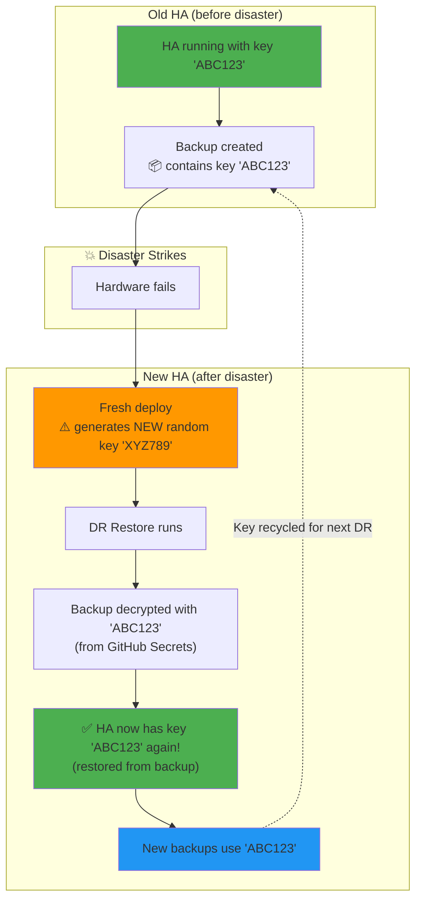
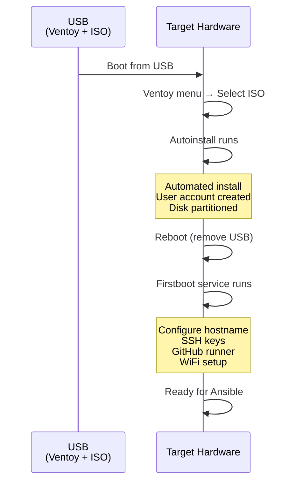
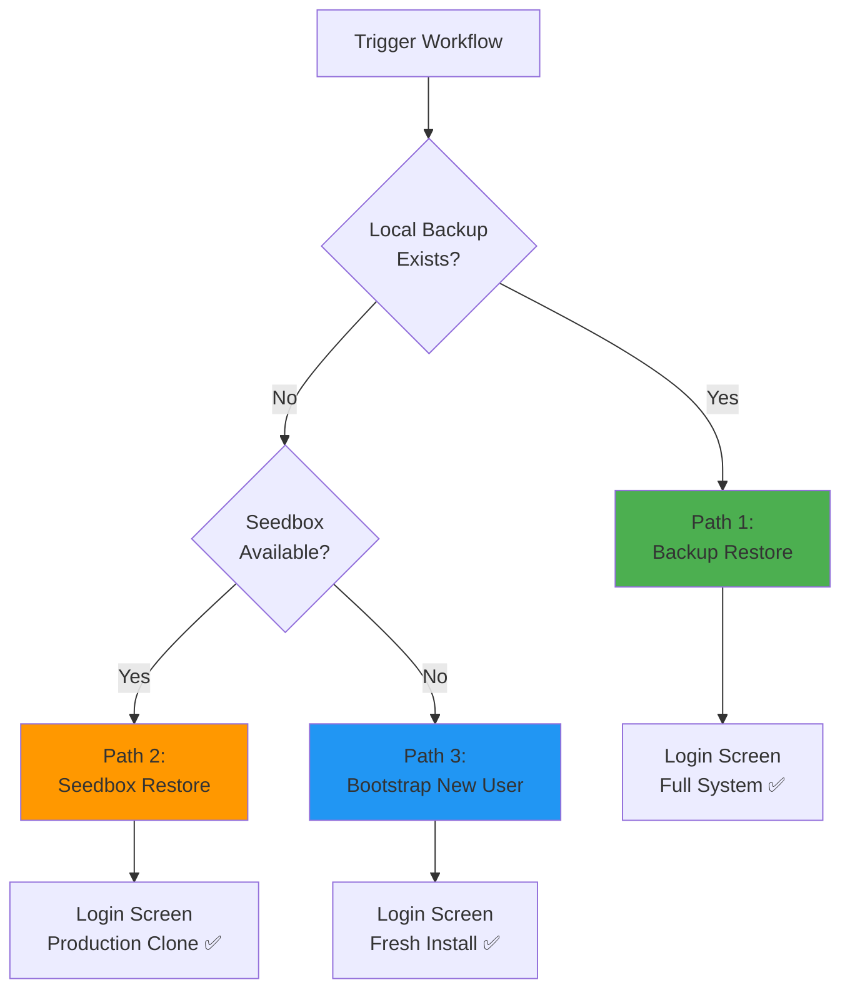
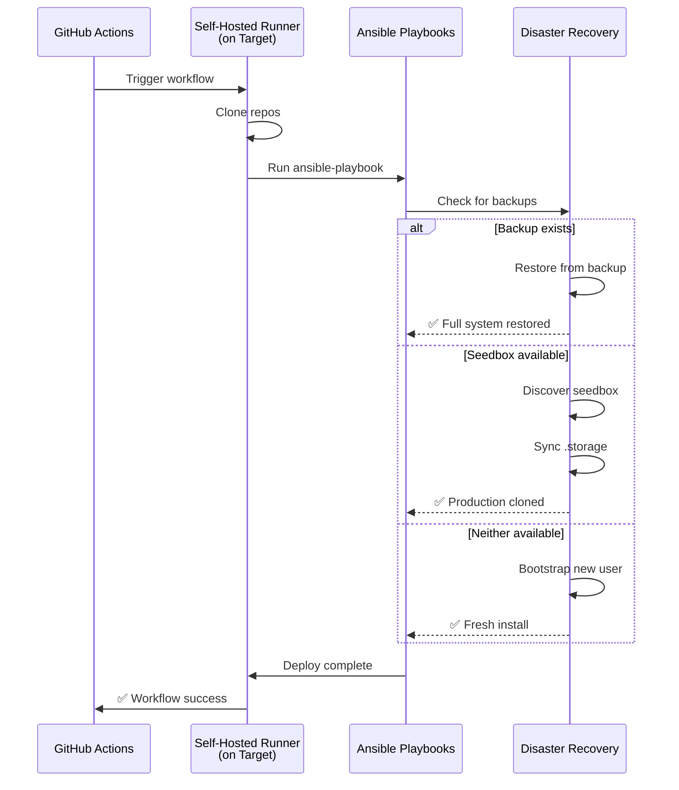
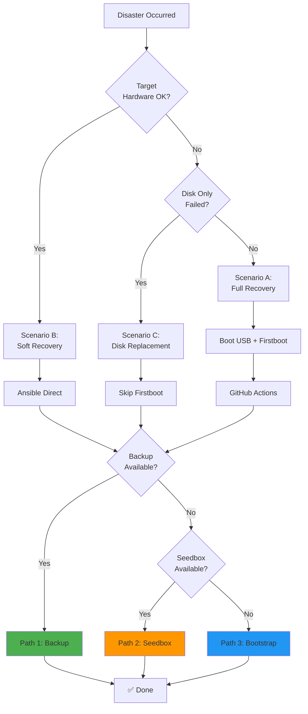
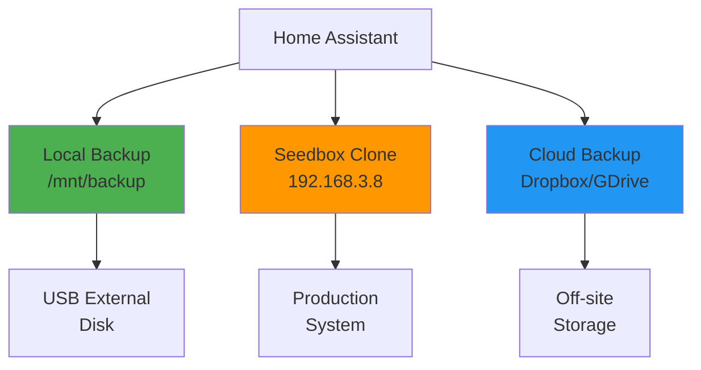

# 🚨 Disaster Recovery Procedure

**Complete step-by-step guide for recovering your homelab after hardware failure.**

---

## 📋 Scenarios

This document covers the following disaster scenarios:

| Scenario | Target node Status              | Recovery Method |
|----------|---------------------------------|-----------------|
| **A** | Completely defect               | USB install + GitHub Actions |
| **B** | Still working, .storage corrupt | Ansible direct recovery |
| **C** | SD card/disk broken             | USB install + GitHub Actions |
| **D** | Complete fresh start            | USB install + GitHub Actions + Bootstrap |

---

## 🎯 Scenario A: Complete Hardware Failure

**Situatie:** Your laptop/Raspberry Pi completely ruined, you got new hardware.

### Prerequisites Checklist

Make sure you have the following:

- [ ] ✅ New target hardware (laptop/Pi/server)
- [ ] ✅ USB stick (8GB+)
- [ ] ✅ Controller node (other laptop with Ansible)
- [ ] ✅ GitHub repository access
- [ ] ✅ `.env` file with secrets (backup of this!)
- [ ] ✅ Network access to seedbox (optional)
- [ ] ✅ Local backup encrypted files (optional, in `/mnt/backup/homeassistant/`)

## 🔐 Backup Encryption Key Management

### How the Backup Key Works

The backup encryption key is stored in **two places**:
1. **GitHub Secrets** (`HA_BACKUP_ENCRYPT_KEY`) - used by DR playbook to decrypt backups
2. **Inside HA's .storage** - restored along with the backup!

### Key Behavior During Deploy vs Restore

| Action | Effect on Encryption Key |
|--------|-------------------------|
| **Fresh deploy** (no backup restore) | NEW random key generated |
| **Backup restore** | Key FROM the backup is restored to HA |

**This is the key insight:** When you restore from a backup, the encryption key stored inside that backup becomes HA's active key. New backups will then be encrypted with that same key.

### Backup Key Lifecycle: How Key Recycling Works



**The magic:** Even though a fresh deploy generates a new random key, the backup restore overwrites it with the key from the backup. This means your `HA_BACKUP_ENCRYPT_KEY` in GitHub Secrets stays valid forever, as long as you always restore from a backup that contains that key.

### One-Time Setup: Lock In Your Fixed Key

To ensure your key gets recycled through every DR:

| Step | Action | Why |
|------|--------|-----|
| 1 | Get current key from HA:<br/>`Settings → System → Backups → (i) → Encryption key` | This is the key inside your backups |
| 2 | Store in GitHub Secrets:<br/>`HA_BACKUP_ENCRYPT_KEY = <that key>` | DR playbook uses this to decrypt |
| 3 | Create a fresh backup:<br/>`Settings → System → Backups → Create backup` | Ensures latest backup has the key |
| 4 | Delete old backups with different keys:<br/>`sudo rm /mnt/backup/homeassistant/*.tar` | Prevents "Unknown format" errors |

**After this setup:** Every future DR will restore this key, and new backups will contain it. The cycle continues indefinitely.

### Troubleshooting "Unknown format" Error

This error means key mismatch between Secrets and backup. Solutions:
1. **Seedbox restore** - if seedbox is online, .storage is synced directly (no decryption needed)
2. **Get key from running HA** - Settings → System → Backups → (i) → Encryption key → update Secrets
3. **Bootstrap** - fresh install without backup restore (`-e ha_bootstrap_enable=true`)

### Phase 1: USB Preparation (10 minutes)


**On your Controller node:**

```bash
cd ~/homelab/infra/boot

# Run USB creator script:
sudo ./create-install-usb.sh

# Wizard will ask:
# 1. Architecture (x86_64 or ARM64)
# 2. Hostname
# 3. GitHub username
# 4. GitHub repository
# 5. GitHub PAT (Personal Access Token)
# 6. WiFi credentials (optional)
```

**Result:** Single bootable USB with:
- **Ventoy** multiboot loader (x86) or bootable image (Pi4)
- **Ubuntu ISO** (x86) or preinstalled image (Pi4)
- **Autoinstall config** with embedded setup script
- **Setup script** runs automatically on first boot

---

### Phase 2: Target node Installation (20 minutes)



> **NETWORK NOTE (x86 only):** Connect ethernet cable BEFORE booting from USB. The x86 autoinstall may fail if no network is available during installation. Pi4 works offline.

**Steps:**

1. **Boot from USB:**
   ```bash
   # Insert USB into Target node
   # Boot from USB (F12/F2 for boot menu)
   # Select USB drive
   ```

2. **x86: Ventoy Menu:**
   - Select the Ubuntu ISO
   - Choose "Try or Install Ubuntu" from GRUB menu
   - **Autoinstall runs automatically** (no user input needed!)
   - Wait ~10 minutes for installation
   - System reboots automatically

3. **Pi4: Flash to M.2:**
   - Login: `ubuntu` / `yourpassword`
   - Run: `sudo flash-to-m2`
   - Type `yes` to confirm
   - Power off, remove USB, reconnect M.2 cable
   - Boot from M.2

4. **First Boot (automatic):**
   ```bash
   # Firstboot service runs automatically:
   # ✅ Set hostname
   # ✅ Configure SSH key
   # ✅ Enable passwordless sudo
   # ✅ Configure WiFi (if specified)
   # ✅ Install + register GitHub runner
   # 💣 Self-destruct (service disables itself)
   ```

5. **Verify Setup:**
   ```bash
   # SSH to target:
   ssh ubuntu@<hostname>.local

   # Check hostname:
   hostname

   # Check GitHub runner:
   systemctl status actions.runner.*

   # Or check on GitHub:
   # https://github.com/{user}/{repo}/settings/actions/runners
   # You should see your Target node listed as "Online"
   ```

**Result:** Target node is configured and GitHub runner is registered! ✅

---

### Phase 3: Disaster Recovery via GitHub Actions (30 minutes)



**On GitHub:**

1. **Navigate to Actions:**
   ```
   https://github.com/{your-username}/homelab-infra/actions
   ```

2. **Select Workflow:**
   - Click "Deploy Home Assistant" workflow
   - Click "Run workflow" button (top right)

3. **Configure Run:**
   - Branch: `main` (or your branch)
   - Click "Run workflow" (green button)

4. **Monitor Progress:**
   - Click on the running workflow
   - Watch real-time logs
   - Typical duration: 15-30 minutes

**What Happens Automatically:**



**Recovery Paths:**

#### 🟢 Path 1: Backup Restore (Fastest, Most Complete)

**Prerequisites:**
- Local backup exists: `/mnt/backup/homeassistant/*.tar`
- Backup volume mounted on target node

**What Gets Restored:**
- ✅ All users and authentication
- ✅ All entities (lights, sensors, switches)
- ✅ All devices (integrations, ESPs)
- ✅ All automations and scripts
- ✅ History and statistics
- ✅ Configuration files

**Result:** 
- Login screen with **original users**
- System exactly as it was at backup time
- Duration: ~15 minutes

#### 🟠 Path 2: Seedbox Restore (Production Clone)

**Prerequisites:**
- Seedbox/production HA running on network (can be supervised version of HA)
- Network connectivity: `192.168.3.0/24` (configurable)
- SSH access to seedbox

**What Gets Restored:**
- ✅ All users and authentication (from production)
- ✅ All entities (from production)
- ✅ All devices (from production)
- ✅ Current production state
- ✅ Configuration files (from repo)

**Result:**
- Login screen with **production users**
- Clone of production system
- Duration: ~20 minutes

#### 🔵 Path 3: Bootstrap (Fresh Install)

**Prerequisites:**
- No backup available
- No seedbox reachable

**What Gets Created:**
- ✅ New admin user (from secrets)
- ✅ Fresh HA installation
- ✅ Configuration files (from repo)
- ❌ No entities (must re-configure)
- ❌ No history

**Result:**
- Login screen with **new user** (HA_USER_USERNAME from secrets)
- Fresh system, must add integrations
- Duration: ~10 minutes

---

### Phase 4: Verification (5 minutes)

**After workflow completes successfully:**

1. **Check Target node:**
   ```bash
   # SSH to Target node:
   ssh ubuntu@<target-hostname>.local
   # or
   ssh ubuntu@<target-ip>
   
   # Check containers:
   docker ps
   
   # Should see:
   # - homeassistant_ansible
   # - cloudflared (if enabled)
   # - esphome (if enabled)
   # - code_server (if enabled)
   ```

2. **Access Home Assistant:**
   ```bash
   # In browser:
   http://<target-ip>:8123
   
   # Expected:
   # - Login screen (NOT onboarding!)
   # - Login with appropriate credentials
   ```

3. **Verify Recovery Path:**
   - Check GitHub Actions logs for summary:
     - "✅ Restore completed successfully" (backup or seedbox)
     - "🆕 Fresh install - bootstrap ran" (bootstrap)

**Result:** Your homelab is BACK! 🎉

---

## 🔄 Scenario B: Soft Recovery (Target node Still Works)

**Situation:** Target node is running but `.storage/` is corrupt, or you want fresh state.

### Quick Recovery from Controller node

```bash
cd ~/homelab/infra

# Option 1: Normal recovery (preserves existing .storage/)
ansible-playbook -i inventories/ha_target_remote.ini site.yml -l ha_target -e env_file=../.env

# Option 2: Fresh recovery (clean .storage/)
ansible-playbook -i inventories/ha_target_remote.ini site.yml -l ha_target -e env_file=../.env -e fresh_install=true
```

**Result:** Same disaster recovery flow as GitHub Actions, but triggered directly from Controller node.

---

## 💾 Scenario C: Disk Failure (OS Works, Disk Corrupt)

**Situation:** SD card corrupt on Raspberry Pi, or disk failure on laptop.

### Steps

Same as **Scenario A**, but:
1. Firstboot already ran (SSH already configured)
2. Manually mount backup volume if needed:
   ```bash
   # On Target node:
   sudo mkdir -p /mnt/backup
   sudo mount /dev/sdb1 /mnt/backup
   ```
3. Run GitHub Actions workflow or Ansible directly

---

## 🆕 Scenario D: True Fresh Start

**Situation:** Starting completely fresh, no existing data to recover.

### Expected Behavior

Following **Scenario A** will result in:
- Bootstrap runs (Path 3)
- New admin user created
- Login screen with fresh HA
- Must configure all integrations manually

### Post-Bootstrap Tasks

1. **Add Integrations:**
   - Settings → Devices & Services
   - Add integrations (Zigbee, Z-Wave, etc.)

2. **Configure Automations:**
   - Either manually via UI
   - Or import from YAML files in config repo

3. **Set Up Backup:**
   - Settings → System → Backups
   - Configure automatic backups
   - Ensure `/mnt/backup` volume is mounted

---

## 🔙 Emergency Version Rollback

If a HA version causes issues after deploy:

**Via GitHub Actions:**
```
GitHub → Actions → Deploy Home Assistant → Run workflow
→ ha_version_override: 2025.12.4  # Last known good version
→ Run workflow
```

**Via Controller node:**
```bash
ansible-playbook -i inventories/ha_target_remote.ini site.yml \
  -l ha_target \
  -e env_file=../.env \
  -e ha_version_override=2025.12.4
```

This downgrades HA but keeps all your data and configuration intact.


## 🎯 Recovery Decision Tree



---

## 🔑 Critical Information to Backup

**KEEP THESE SAFE (separate from homelab):**

### 1. Secrets (`.env` file)
```bash
# Store securely (password manager, encrypted USB):
GITHUB_USERNAME=xxx
GITHUB_PAT=ghp_xxx
CF_TUNNEL_TOKEN=xxx
HA_USER_USERNAME=xxx
HA_USER_PASSWORD=xxx
HA_BACKUP_ENCRYPT_KEY=xxx
SSH_PRIV_KEY_B64=xxx
```

### 2. SSH Keys
```bash
~/.ssh/id_ed25519        # Private key
~/.ssh/id_ed25519.pub    # Public key
```

### 3. GitHub Repository Access
- Personal Access Token (PAT)
- Scopes: `repo`, `workflow`, `admin:org`

### 4. Backup Files (Optional)
```bash
/mnt/backup/homeassistant/*.tar
```

**💡 Pro Tip:** Store `.env` and SSH keys in password manager (1Password, Bitwarden) so you can recreate them on any device!

---

## ⏱️ Expected Duration

| Phase | Duration      | Hands-On Time |
|-------|---------------|---------------|
| USB Preparation | 10 min        | 10 min |
| Ubuntu Installation | 20 min        | 5 min (mostly waiting) |
| Setup Script | 5 min         | 2 min |
| GitHub Actions Deploy | 2-3 min      | 1 min (just trigger) |
| **Total** | **50-65 min** | **~18 min active** |

**Most time is waiting for:**
- Ubuntu installation (~10 min)
- Ansible deployment (~2-3 min)

**Actual hands-on work:** ~18 minutes! 🎯

---

## ✅ Post-Recovery Checklist

After successful recovery:

- [ ] ✅ Login to Home Assistant works
- [ ] ✅ All integrations present (if restored from backup/seedbox)
- [ ] ✅ Automations running
- [ ] ✅ Cloudflared tunnel accessible (if enabled)
- [ ] ✅ GitHub runner showing as "Idle" (not "Offline")
- [ ] ✅ Backups configured and working
- [ ] ✅ Test automation or two to verify functionality
- [ ] ✅ Update documentation if anything changed

---

## 🆘 Troubleshooting

### USB Script Failed

**Problem:** `create-install-usb.sh` exits with error

**Solutions:**
```bash
# Run as root:
sudo ./create-install-usb.sh

# Check USB drives detected:
lsblk

# Verify USB drive visible:
lsblk | grep -E "sd[b-z]"
```

### Firstboot Script Not Running

**Problem:** Machine boots but setup didn't run

**Solutions:**
```bash
# Check firstboot service status:
systemctl status firstboot-setup.service

# View logs:
journalctl -u firstboot-setup.service

# Manually run if needed (x86):
sudo bash /opt/setup/setup-machine.sh

# Manually run if needed (Pi4):
sudo bash /opt/pi4-flash/setup-machine.sh
```

### GitHub Runner Not Showing

**Problem:** Runner not appearing in GitHub settings

**Solutions:**
```bash
# On Target node, check runner status:
systemctl status actions.runner.*

# Check runner logs:
cd ~/actions-runner
cat _diag/Runner_*.log

# Manually restart runner:
cd ~/actions-runner
sudo ./svc.sh restart

# Re-run setup-machine.sh if runner installation failed
```

### Workflow Fails - No Backup or Seedbox

**Problem:** Workflow completes but bootstrap didn't run

**Solutions:**
```bash
# Verify backup directory:
ssh ubuntu@<target> "ls -la /mnt/backup/homeassistant/"

# Test seedbox connectivity:
nmap -p 8123 --open 192.168.3.0/24

# Check workflow logs for disaster recovery summary

# Manually trigger with fresh install:
# Re-run workflow (bootstrap will run automatically)
```

### Can't Login After Recovery

**Problem:** Login screen appears but credentials don't work

**Solutions:**
```bash
# Check which recovery path ran (from workflow logs):
# - "Restore completed" → Use original credentials
# - "Bootstrap ran" → Use HA_USER_USERNAME/PASSWORD from secrets

# Reset password via container:
ssh ubuntu@<target>
docker exec -it homeassistant_ansible bash
python -m homeassistant --script auth change_password <username>
```

---

## 🎓 Best Practices

### Regular Testing

**Test your disaster recovery regularly:**

```bash
# Once per month:
# 1. Trigger backup restore on test system
# 2. Verify seedbox restore works
# 3. Test bootstrap on fresh VM

# Quick test:
ansible-playbook -i inventories/ha_target_remote.ini site.yml \
  -l ha_target \
  -e env_file=../.env \
  -e fresh_install=true
```

### Keep Secrets Updated

```bash
# Update .env file whenever credentials change:
vim ~/homelab/.env

# Rotate GitHub PAT every 6 months:
# https://github.com/settings/tokens

# Test .env file:
ansible-playbook -i inventories/ha_target_remote.ini site.yml \
  -l ha_target \
  -e env_file=../.env \
  --check
```

### Multiple Backup Strategies



**Recommendation:** Use all three!
- Local backup: Fastest recovery
- Seedbox: Production clone
- Cloud: Off-site safety

---

## 📞 Emergency Contacts

**Keep these handy during disaster:**

| Resource | Link |
|----------|------|
| This Guide | `~/homelab/infra/DISASTER_RECOVERY.md` |
| Quick Ref | `~/homelab/infra/QUICKREF.md` |
| README | `~/homelab/infra/README.md` |
| GitHub Repo | `https://github.com/{user}/homelab-infra` |
| HA Docs | `https://www.home-assistant.io/docs/` |
| Ansible Docs | `https://docs.ansible.com/` |

---

**Last Updated:** January 2026

**Remember:** Stay calm, follow the steps, and your homelab will be back online soon! 🚀
