# 🚨 Disaster Recovery Procedure

**Complete step-by-step guide for recovering your homelab after hardware failure.**

---

## 📋 Scenarios

This document covers the following disaster scenarios:

| Scenario | Target node Status              | Recovery Method |
|----------|---------------------------------|-----------------|
| **A** | Completely defect               | USB install + GitHub Actions |
| **B** | Still working, .storage corrupt | Ansible direct recovery |
| **C** | SD card/disk broken             | USB install + GitHub Actions |
| **D** | Complete fresh start            | USB install + GitHub Actions + Bootstrap |

---

## 🎯 Scenario A: Complete Hardware Failure

**Situatie:** Your laptop/Raspberry Pi completely ruined, you got new hardware.

### Prerequisites Checklist

Make sure you have the following:

- [ ] ✅ New target hardware (laptop/Pi/server)
- [ ] ✅ 2x USB sticks (8GB+ and 1GB+)
- [ ] ✅ Controller node (other laptop with Ansible)
- [ ] ✅ GitHub repository access
- [ ] ✅ `.env` file with secrets (backup of this!)
- [ ] ✅ Network access to seedbox (optional)
- [ ] ✅ Local backup encrypted files (optional, in `/mnt/backup/homeassistant/`)

## 🔐 Backup Encryption Key Management

### Critical: Each Deploy = New Encryption Key

**Every successful HA deployment generates a NEW random backup encryption key.**

This means:
- ✅ Old backups (before deploy) → Encrypted with OLD key
- ✅ New backups (after deploy) → Encrypted with NEW key
- ❌ OLD key cannot decrypt NEW backups
- ❌ NEW key cannot decrypt OLD backups

### Post-Deploy Checklist

After a successful deployment and first backup:

1. **Create first backup with new key:**
```
   HA UI → Settings → System → Backups → Create backup
```

2. **Update HA_BACKUP_ENCRYPT_KEY:**
- **Controller node (.env file):**
```bash
     # Find new key in HA
     # HA UI → Settings → System → Backups → (i) icon → Encryption key
     
     # Update .env
     vim ../.env
     # Change: HA_BACKUP_ENCRYPT_KEY=<new-key>
```

- **GitHub Secrets:**
```
     GitHub → Settings → Secrets and variables → Actions
     → Update HA_BACKUP_ENCRYPT_KEY
```

3. **Remove old backups (optional but recommended):**
```bash
   ssh ubuntu@<target>
   sudo rm /mnt/backup/homeassistant/*.tar
```

Reason: They use the old key and will fail to restore.

### Why This Matters

During disaster recovery, the playbook:
1. Looks for backups in `/mnt/backup/homeassistant/`
2. Tries newest backup first
3. Uses `HA_BACKUP_ENCRYPT_KEY` from secrets/env
4. **If key mismatch → "Unknown format" error**

**Common mistake:** Deploy succeeds → HA creates new backup → Old key still in secrets → Next disaster recovery fails!

### Phase 1: USB Preparation (10 minutes)


**On your Controller node:**

```bash
cd ~/homelab/infra/boot

# Run USB creator script:
sudo ./create-two-usb-setup.sh

# Wizard will ask:
# 1. Architecture (x86_64 or ARM64)
# 2. Ubuntu version (LTS or latest)
# 3. Hostname
# 4. SSH public key
# 5. GitHub username
# 6. GitHub repository
# 7. GitHub PAT (Personal Access Token)
```

**Result:** 2 USB sticks ready:
- **USB 1:** Bootable Ubuntu Desktop ISO
- **USB 2:** Setup script with self-destruct

---

### Phase 2: Target node Installation (20 minutes)

```mermaid
sequenceDiagram
    participant USB1 as USB 1<br/>(Ubuntu ISO)
    participant Target as Target Hardware
    participant USB2 as USB 2<br/>(Setup Script)
    
    USB1->>Target: Boot
    Target->>Target: Manual Ubuntu Install
    Note over Target: Create user<br/>Configure network<br/>Install to disk
    Target->>Target: Reboot
    USB2->>Target: Insert USB 2
    Target->>Target: Run setup-machine.sh
    Note over Target: Configure hostname<br/>SSH keys<br/>GitHub runner<br/>💣 Self-destruct
    Target->>Target: Ready for Ansible
```



**Steps:**

1. **Boot from USB 1:**
   ```bash
   # Insert USB 1 into Target node
   # Boot from USB (F12/F2 for boot menu)
   # Select USB drive
   ```

2. **Install Ubuntu:**
   - Select language
   - Choose "Install Ubuntu"
   - Select keyboard layout
   - Connect to WiFi/Ethernet
   - Choose installation type: "Erase disk and install Ubuntu"
   - Select timezone
   - **Create user** (any username, you choose password)
   - Wait ~10 minutes for installation
   - Remove USB 1 when prompted
   - Reboot

3. **First Boot:**
   ```bash
   # Log in with created user
   # Verify network: ping 8.8.8.8
   # Insert USB 2
   ```

4. **Run Setup Script:**
   ```bash
   # USB 2 should auto-mount to /media/<username>/SETUP
   cd /media/<username>/SETUP
   
   # Run the setup script:
   sudo bash setup-machine.sh
   
   # Script will:
   # ✅ Set hostname
   # ✅ Configure SSH key
   # ✅ Enable passwordless sudo
   # ✅ Install openssh-server
   # ✅ Install + register GitHub runner
   # 💣 Self-destruct (delete itself!)
   
   # Wait for "Machine is ready! 🚀"
   ```

5. **Verify Setup:**
   ```bash
   # Check hostname:
   hostname
   
   # Check GitHub runner (on Target node):
   systemctl status actions.runner.*
   
   # Or check on GitHub:
   # https://github.com/{user}/{repo}/settings/actions/runners
   # You should see your Target node listed as "Online"
   ```

**Result:** Target node is configured and GitHub runner is registered! ✅

---

### Phase 3: Disaster Recovery via GitHub Actions (30 minutes)

```mermaid
graph TD
    A[Trigger Workflow] --> B{Local Backup<br/>Exists?}
    B -->|Yes| C[Path 1:<br/>Backup Restore]
    B -->|No| D{Seedbox<br/>Available?}
    D -->|Yes| E[Path 2:<br/>Seedbox Restore]
    D -->|No| F[Path 3:<br/>Bootstrap New User]
    
    C --> G[Login Screen<br/>Full System ✅]
    E --> H[Login Screen<br/>Production Clone ✅]
    F --> I[Login Screen<br/>Fresh Install ✅]
    
    style C fill:#4caf50
    style E fill:#ff9800
    style F fill:#2196f3
```



**On GitHub:**

1. **Navigate to Actions:**
   ```
   https://github.com/{your-username}/homelab-infra/actions
   ```

2. **Select Workflow:**
   - Click "Deploy Home Assistant" workflow
   - Click "Run workflow" button (top right)

3. **Configure Run:**
   - Branch: `main` (or your branch)
   - Click "Run workflow" (green button)

4. **Monitor Progress:**
   - Click on the running workflow
   - Watch real-time logs
   - Typical duration: 15-30 minutes

**What Happens Automatically:**

```mermaid
sequenceDiagram
    participant GH as GitHub Actions
    participant Runner as Self-Hosted Runner<br/>(on Target)
    participant Ansible as Ansible Playbooks
    participant Recovery as Disaster Recovery
    
    GH->>Runner: Trigger workflow
    Runner->>Runner: Clone repos
    Runner->>Ansible: Run ansible-playbook
    Ansible->>Recovery: Check for backups
    
    alt Backup exists
        Recovery->>Recovery: Restore from backup
        Recovery-->>Ansible: ✅ Full system restored
    else Seedbox available
        Recovery->>Recovery: Discover seedbox
        Recovery->>Recovery: Sync .storage
        Recovery-->>Ansible: ✅ Production cloned
    else Neither available
        Recovery->>Recovery: Bootstrap new user
        Recovery-->>Ansible: ✅ Fresh install
    end
    
    Ansible->>Runner: Deploy complete
    Runner->>GH: ✅ Workflow success
```



**Recovery Paths:**

#### 🟢 Path 1: Backup Restore (Fastest, Most Complete)

**Prerequisites:**
- Local backup exists: `/mnt/backup/homeassistant/*.tar`
- Backup volume mounted on target node

**What Gets Restored:**
- ✅ All users and authentication
- ✅ All entities (lights, sensors, switches)
- ✅ All devices (integrations, ESPs)
- ✅ All automations and scripts
- ✅ History and statistics
- ✅ Configuration files

**Result:** 
- Login screen with **original users**
- System exactly as it was at backup time
- Duration: ~15 minutes

#### 🟠 Path 2: Seedbox Restore (Production Clone)

**Prerequisites:**
- Seedbox/production HA running on network (can be supervised version of HA)
- Network connectivity: `192.168.3.0/24` (configurable)
- SSH access to seedbox

**What Gets Restored:**
- ✅ All users and authentication (from production)
- ✅ All entities (from production)
- ✅ All devices (from production)
- ✅ Current production state
- ✅ Configuration files (from repo)

**Result:**
- Login screen with **production users**
- Clone of production system
- Duration: ~20 minutes

#### 🔵 Path 3: Bootstrap (Fresh Install)

**Prerequisites:**
- No backup available
- No seedbox reachable

**What Gets Created:**
- ✅ New admin user (from secrets)
- ✅ Fresh HA installation
- ✅ Configuration files (from repo)
- ❌ No entities (must re-configure)
- ❌ No history

**Result:**
- Login screen with **new user** (HA_USER_USERNAME from secrets)
- Fresh system, must add integrations
- Duration: ~10 minutes

---

### Phase 4: Verification (5 minutes)

**After workflow completes successfully:**

1. **Check Target node:**
   ```bash
   # SSH to Target node:
   ssh ubuntu@<target-hostname>.local
   # or
   ssh ubuntu@<target-ip>
   
   # Check containers:
   docker ps
   
   # Should see:
   # - homeassistant_ansible
   # - cloudflared (if enabled)
   # - esphome (if enabled)
   # - code_server (if enabled)
   ```

2. **Access Home Assistant:**
   ```bash
   # In browser:
   http://<target-ip>:8123
   
   # Expected:
   # - Login screen (NOT onboarding!)
   # - Login with appropriate credentials
   ```

3. **Verify Recovery Path:**
   - Check GitHub Actions logs for summary:
     - "✅ Restore completed successfully" (backup or seedbox)
     - "🆕 Fresh install - bootstrap ran" (bootstrap)

**Result:** Your homelab is BACK! 🎉

---

## 🔄 Scenario B: Soft Recovery (Target node Still Works)

**Situation:** Target node is running but `.storage/` is corrupt, or you want fresh state.

### Quick Recovery from Controller node

```bash
cd ~/homelab/infra

# Option 1: Normal recovery (preserves existing .storage/)
ansible-playbook -i inventories/ha_target_remote.ini site.yml -l ha_target -e env_file=../.env

# Option 2: Fresh recovery (clean .storage/)
ansible-playbook -i inventories/ha_target_remote.ini site.yml -l ha_target -e env_file=../.env -e fresh_install=true
```

**Result:** Same disaster recovery flow as GitHub Actions, but triggered directly from Controller node.

---

## 💾 Scenario C: Disk Failure (OS Works, Disk Corrupt)

**Situation:** SD card corrupt on Raspberry Pi, or disk failure on laptop.

### Steps

Same as **Scenario A**, but:
1. Skip USB 2 setup script (SSH already configured)
2. Manually mount backup volume if needed:
   ```bash
   # On Target node:
   sudo mkdir -p /mnt/backup
   sudo mount /dev/sdb1 /mnt/backup
   ```
3. Run GitHub Actions workflow or Ansible directly

---

## 🆕 Scenario D: True Fresh Start

**Situation:** Starting completely fresh, no existing data to recover.

### Expected Behavior

Following **Scenario A** will result in:
- Bootstrap runs (Path 3)
- New admin user created
- Login screen with fresh HA
- Must configure all integrations manually

### Post-Bootstrap Tasks

1. **Add Integrations:**
   - Settings → Devices & Services
   - Add integrations (Zigbee, Z-Wave, etc.)

2. **Configure Automations:**
   - Either manually via UI
   - Or import from YAML files in config repo

3. **Set Up Backup:**
   - Settings → System → Backups
   - Configure automatic backups
   - Ensure `/mnt/backup` volume is mounted

---

## 🔙 Emergency Version Rollback

If a HA version causes issues after deploy:

**Via GitHub Actions:**
```
GitHub → Actions → Deploy Home Assistant → Run workflow
→ ha_version_override: 2025.12.4  # Last known good version
→ Run workflow
```

**Via Controller node:**
```bash
ansible-playbook -i inventories/ha_target_remote.ini site.yml \
  -l ha_target \
  -e env_file=../.env \
  -e ha_version_override=2025.12.4
```

This downgrades HA but keeps all your data and configuration intact.


## 🎯 Recovery Decision Tree


---

## 🔑 Critical Information to Backup

**KEEP THESE SAFE (separate from homelab):**

### 1. Secrets (`.env` file)
```bash
# Store securely (password manager, encrypted USB):
GITHUB_USERNAME=xxx
GITHUB_PAT=ghp_xxx
CF_TUNNEL_TOKEN=xxx
HA_USER_USERNAME=xxx
HA_USER_PASSWORD=xxx
HA_BACKUP_ENCRYPT_KEY=xxx
SSH_PRIV_KEY_B64=xxx
```

### 2. SSH Keys
```bash
~/.ssh/id_ed25519        # Private key
~/.ssh/id_ed25519.pub    # Public key
```

### 3. GitHub Repository Access
- Personal Access Token (PAT)
- Scopes: `repo`, `workflow`, `admin:org`

### 4. Backup Files (Optional)
```bash
/mnt/backup/homeassistant/*.tar
```

**💡 Pro Tip:** Store `.env` and SSH keys in password manager (1Password, Bitwarden) so you can recreate them on any device!

---

## ⏱️ Expected Duration

| Phase | Duration      | Hands-On Time |
|-------|---------------|---------------|
| USB Preparation | 10 min        | 10 min |
| Ubuntu Installation | 20 min        | 5 min (mostly waiting) |
| Setup Script | 5 min         | 2 min |
| GitHub Actions Deploy | 2-3 min      | 1 min (just trigger) |
| **Total** | **50-65 min** | **~18 min active** |

**Most time is waiting for:**
- Ubuntu installation (~10 min)
- Ansible deployment (~2-3 min)

**Actual hands-on work:** ~18 minutes! 🎯

---

## ✅ Post-Recovery Checklist

After successful recovery:

- [ ] ✅ Login to Home Assistant works
- [ ] ✅ All integrations present (if restored from backup/seedbox)
- [ ] ✅ Automations running
- [ ] ✅ Cloudflared tunnel accessible (if enabled)
- [ ] ✅ GitHub runner showing as "Idle" (not "Offline")
- [ ] ✅ Backups configured and working
- [ ] ✅ Test automation or two to verify functionality
- [ ] ✅ Update documentation if anything changed

---

## 🆘 Troubleshooting

### USB Script Failed

**Problem:** `create-two-usb-setup.sh` exits with error

**Solutions:**
```bash
# Run as root:
sudo ./create-two-usb-setup.sh

# Check USB drives detected:
lsblk

# Verify at least 2 USB drives visible:
lsblk | grep -E "sd[b-z]"

# Test mode (skip ISO download):
sudo ./create-two-usb-setup.sh --test-mode
```

### Setup Script Won't Run on Target node

**Problem:** Permission denied running `setup-machine.sh`

**Solutions:**
```bash
# Make executable:
chmod +x /media/<username>/SETUP/setup-machine.sh

# Run with sudo:
sudo bash /media/<username>/SETUP/setup-machine.sh

# If USB not mounted:
sudo mkdir /mnt/usb
sudo mount /dev/sdb1 /mnt/usb
sudo bash /mnt/usb/setup-machine.sh
```

### GitHub Runner Not Showing

**Problem:** Runner not appearing in GitHub settings

**Solutions:**
```bash
# On Target node, check runner status:
systemctl status actions.runner.*

# Check runner logs:
cd ~/actions-runner
cat _diag/Runner_*.log

# Manually restart runner:
cd ~/actions-runner
sudo ./svc.sh restart

# Re-run setup-machine.sh if runner installation failed
```

### Workflow Fails - No Backup or Seedbox

**Problem:** Workflow completes but bootstrap didn't run

**Solutions:**
```bash
# Verify backup directory:
ssh ubuntu@<target> "ls -la /mnt/backup/homeassistant/"

# Test seedbox connectivity:
nmap -p 8123 --open 192.168.3.0/24

# Check workflow logs for disaster recovery summary

# Manually trigger with fresh install:
# Re-run workflow (bootstrap will run automatically)
```

### Can't Login After Recovery

**Problem:** Login screen appears but credentials don't work

**Solutions:**
```bash
# Check which recovery path ran (from workflow logs):
# - "Restore completed" → Use original credentials
# - "Bootstrap ran" → Use HA_USER_USERNAME/PASSWORD from secrets

# Reset password via container:
ssh ubuntu@<target>
docker exec -it homeassistant_ansible bash
python -m homeassistant --script auth change_password <username>
```

---

## 🎓 Best Practices

### Regular Testing

**Test your disaster recovery regularly:**

```bash
# Once per month:
# 1. Trigger backup restore on test system
# 2. Verify seedbox restore works
# 3. Test bootstrap on fresh VM

# Quick test:
ansible-playbook -i inventories/ha_target_remote.ini site.yml \
  -l ha_target \
  -e env_file=../.env \
  -e fresh_install=true
```

### Keep Secrets Updated

```bash
# Update .env file whenever credentials change:
vim ~/homelab/.env

# Rotate GitHub PAT every 6 months:
# https://github.com/settings/tokens

# Test .env file:
ansible-playbook -i inventories/ha_target_remote.ini site.yml \
  -l ha_target \
  -e env_file=../.env \
  --check
```

### Multiple Backup Strategies


**Recommendation:** Use all three!
- Local backup: Fastest recovery
- Seedbox: Production clone
- Cloud: Off-site safety

---

## 📞 Emergency Contacts

**Keep these handy during disaster:**

| Resource | Link |
|----------|------|
| This Guide | `~/homelab/infra/DISASTER_RECOVERY.md` |
| Quick Ref | `~/homelab/infra/QUICKREF.md` |
| README | `~/homelab/infra/README.md` |
| GitHub Repo | `https://github.com/{user}/homelab-infra` |
| HA Docs | `https://www.home-assistant.io/docs/` |
| Ansible Docs | `https://docs.ansible.com/` |

---

**Last Updated:** January 2026

**Remember:** Stay calm, follow the steps, and your homelab will be back online soon! 🚀
