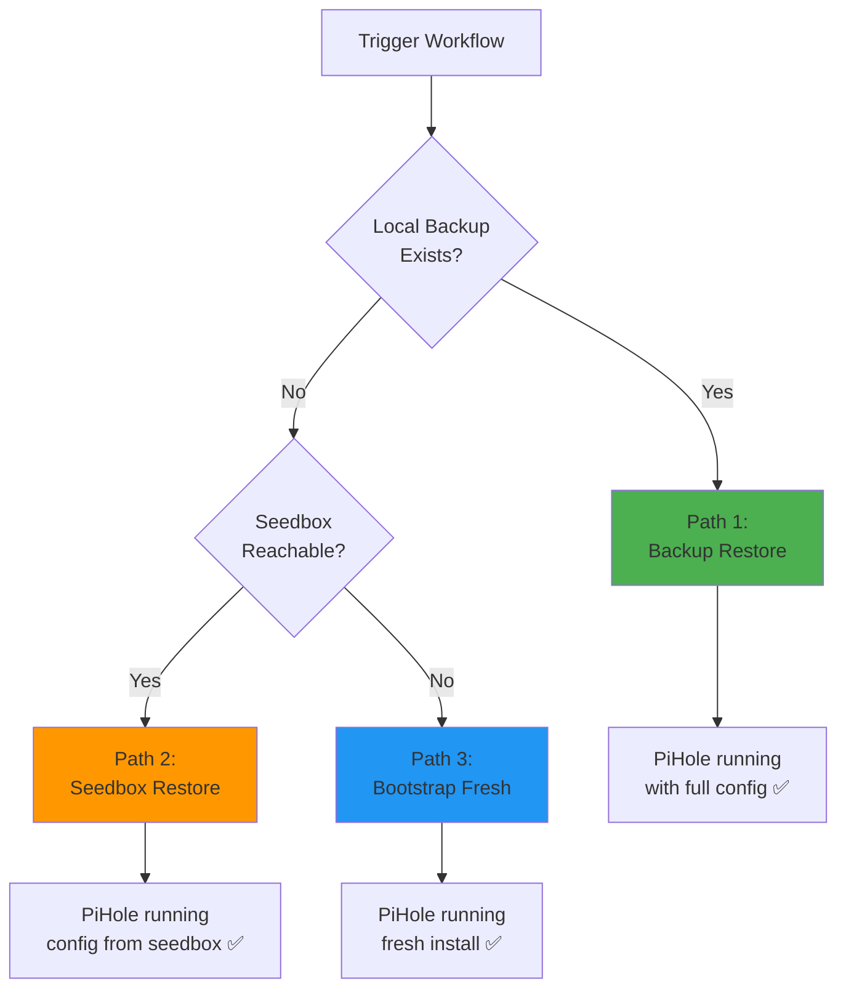

# 🚨 PiHole Disaster Recovery Procedure

**Complete step-by-step guide for recovering your PiHole after hardware failure.**

---

## 📋 Scenarios

| Scenario | Status | Recovery Method |
|----------|--------|-----------------|
| **A** | Completely defect | USB install + GitHub Actions |
| **B** | Still working, config corrupt | Ansible direct recovery |
| **C** | Disk broken | USB install + GitHub Actions |
| **D** | Complete fresh start | USB install + GitHub Actions + Bootstrap |

---

## 🏗️ Hardware & Network

| Device | IP | OS | Runtime |
|--------|----|----|---------|
| Pi4 PiHole (current) | 192.168.3.11 | Ubuntu raspi | Native → Docker after reinstall |
| x86 PiHole (new seedbox) | TBD | Ubuntu x86_64 | Docker |

---

## 🔄 Migration Strategy

The migration follows this order:

```
1. ✅ Add SSH key to current Pi4 PiHole (ubuntu@192.168.3.11)
2. 🆕 Install x86 machine with USB boot → DR pulls config from Pi4 (seedbox restore)
3. ✅ x86 PiHole is now running Docker → acts as seedbox for Pi4
4. 🔄 Reinstall Pi4 with USB boot → DR pulls config from x86 (seedbox restore)
5. ✅ Both machines run Docker PiHole, Pi4 = primary, x86 = seedbox
```

---

## 🎯 Scenario A: Complete Hardware Failure

### Prerequisites Checklist

- [ ] ✅ New target hardware (laptop/Pi/server)
- [ ] ✅ USB stick (8GB+)
- [ ] ✅ GitHub repository access
- [ ] ✅ `.env` file or GitHub Secrets with `PIHOLE_WEB_PASSWORD`
- [ ] ✅ Seedbox reachable (other PiHole at `pihole_seedbox_ip`)
- [ ] ✅ Local backup (optional, in `~/homelab/target/pihole-stack-ansible/backup/`)

---

### Phase 1: USB Preparation (10 minutes)

**Use the existing script — no changes needed:**

```bash
cd ~/homelab/infra/boot

sudo ./create-install-usb.sh

# Wizard will ask:
# 1. Architecture (x86_64 or ARM64)
# 2. Hostname → enter: pihole
# 3. GitHub username → johantre
# 4. GitHub repository → homelab-infra
# 5. GitHub PAT
# 6. WiFi credentials
```

> **Hostname must be `pihole`** — the GitHub runner label is derived from the hostname.
> The `deploy-pihole.yml` workflow runs on `runs-on: [self-hosted, pihole]`.

---

### Phase 2: Target Installation (20 minutes)

Same as Home Assistant — see `DISASTER_RECOVERY.md` Phase 2.

**Key differences:**
- Hostname: `pihole`
- Runner label: `pihole` (automatically set)
- Pi4: Flash to M.2 SSD (same procedure, just a smaller disk — no issues)

---

### Phase 3: Disaster Recovery via GitHub Actions (15 minutes)



**On GitHub:**

1. Navigate to Actions in `homelab-infra` repo
2. Select **"Deploy PiHole"** workflow
3. Click **"Run workflow"**
4. Set `maintenance_mode = false` for disaster recovery
5. Click **"Run workflow"**

---

### Recovery Paths

#### 🟢 Path 1: Backup Restore (Fastest)

**Prerequisites:**
- Local backup: `~/homelab/target/pihole-stack-ansible/backup/*.tar.gz`

**What Gets Restored:**
- ✅ `/etc/pihole/` (all settings, custom lists, gravity.db)
- ✅ `/etc/dnsmasq.d/` (DNS configuration)

#### 🟠 Path 2: Seedbox Restore

**Prerequisites:**
- Seedbox PiHole reachable via SSH at `pihole_seedbox_ip` (192.168.3.11)
- SSH key authorized on seedbox

**What Gets Restored:**
- ✅ Config files (setupVars.conf, custom.list, whitelist, blacklist)
- ✅ DNS settings
- ❌ gravity.db (excluded — rebuilt automatically via `pihole -g`)

**Seedbox detection:**
- Native PiHole: copies from `/etc/pihole/` and `/etc/dnsmasq.d/`
- Docker PiHole: copies from mounted volumes (auto-detected)

#### 🔵 Path 3: Bootstrap (Fresh Install)

**What Gets Created:**
- ✅ Fresh PiHole with WEBPASSWORD from secrets
- ✅ Config files from Git repo applied (custom.list, whitelist, etc.)
- ❌ Blocklists (rebuilt on first `pihole -g` or scheduled update)

---

### Phase 4: Post-Recovery Verification

```bash
# Check container running:
docker ps --filter "name=pihole_ansible"

# Access web UI:
http://<pihole-ip>/admin/

# Test DNS resolution:
nslookup google.com 192.168.3.11

# Test ad blocking:
nslookup doubleclick.net 192.168.3.11
# Expected: 0.0.0.0 (blocked)

# Update gravity database (blocklists):
docker exec pihole_ansible pihole -g
```

---

## 🔄 Scenario B: Soft Recovery (PiHole Still Running)

```bash
cd ~/homelab/infra

# Maintenance mode (config only, preserve volumes):
ansible-playbook -i inventories/pihole_target_remote.ini site.yml \
  -l pihole_target -e env_file=../.env

# Disaster recovery mode (full restore from backup/seedbox):
ansible-playbook -i inventories/pihole_target_remote.ini site.yml \
  -l pihole_target -e env_file=../.env -e maintenance_mode=false
```

---

## 💾 Backup Strategy

### Creating a Manual Backup

```bash
# On the PiHole machine:
TIMESTAMP=$(date +%Y%m%d_%H%M%S)
BACKUP_DIR=~/homelab/target/pihole-stack-ansible/backup

mkdir -p "$BACKUP_DIR"
tar -czf "$BACKUP_DIR/pihole-backup-${TIMESTAMP}.tar.gz" \
  -C ~/homelab/target/pihole-stack-ansible/data \
  pihole-etc dnsmasq-etc

echo "Backup saved: $BACKUP_DIR/pihole-backup-${TIMESTAMP}.tar.gz"
ls -lh "$BACKUP_DIR/"
```

### What's in a Backup

```
pihole-backup-20260101_120000.tar.gz
├── pihole-etc/
│   ├── setupVars.conf      ← Core settings
│   ├── custom.list         ← Custom DNS entries
│   ├── whitelist.txt       ← Whitelist
│   ├── blacklist.txt       ← Blacklist
│   ├── regex.list          ← Regex filters
│   ├── gravity.db          ← Compiled blocklist DB
│   └── pihole-FTL.db       ← Query log
└── dnsmasq-etc/
    ├── 01-pihole.conf      ← Main DNS config
    └── 02-pihole-dhcp.conf ← DHCP config (if enabled)
```

---

## 🔑 Critical Information to Backup

**Keep these safe (separate from homelab):**

```bash
# GitHub Secrets required:
PIHOLE_WEB_PASSWORD=xxx        # Admin web UI password
GH_USERNAME=xxx
GH_PAT=ghp_xxx
SSH_PRIV_KEY_B64=xxx           # Base64-encoded SSH private key
```

---

## ✅ Post-Recovery Checklist

- [ ] ✅ PiHole container running (`docker ps`)
- [ ] ✅ Web UI accessible at `http://<ip>/admin/`
- [ ] ✅ Login works with `PIHOLE_WEB_PASSWORD`
- [ ] ✅ DNS resolving: `nslookup google.com <pihole-ip>`
- [ ] ✅ Ad blocking working: `nslookup doubleclick.net <pihole-ip>` → 0.0.0.0
- [ ] ✅ Custom DNS entries present (check `http://<ip>/admin/dns_records.php`)
- [ ] ✅ Gravity database up-to-date (run `pihole -g` if needed)
- [ ] ✅ GitHub runner showing as "Idle" in GitHub settings
- [ ] ✅ Network devices using PiHole as DNS server

---

## 🆘 Troubleshooting

### DNS Not Working

```bash
# Check port 53 is listening:
ss -tuln | grep :53

# Test DNS on the PiHole machine itself:
dig @127.0.0.1 google.com

# Check container logs:
docker logs pihole_ansible --tail 50
```

### Web UI Not Accessible

```bash
# Check container status:
docker ps -a --filter "name=pihole_ansible"

# Check port 80:
curl -v http://localhost/admin/

# Restart container:
docker restart pihole_ansible
```

### Seedbox SSH Fails

```bash
# Verify SSH key on seedbox:
ssh ubuntu@192.168.3.11 "echo OK"

# If fails, add SSH key to seedbox:
ssh ubuntu@192.168.3.11  # login with password
echo "ssh-ed25519 AAAA..." >> ~/.ssh/authorized_keys
chmod 600 ~/.ssh/authorized_keys
```

### Gravity Update After Bootstrap

```bash
# Force gravity database rebuild (downloads all blocklists):
docker exec pihole_ansible pihole -g

# This may take a few minutes
# Check progress:
docker logs pihole_ansible -f
```

---

## 📞 References

| Resource | Location |
|----------|----------|
| This Guide | `~/homelab/infra/DISASTER_RECOVERY_PIHOLE.md` |
| HA DR Guide | `~/homelab/infra/DISASTER_RECOVERY.md` |
| PiHole Docs | https://docs.pi-hole.net/ |
| PiHole Docker | https://github.com/pi-hole/docker-pi-hole |

---

**Last Updated:** February 2026
