# 🏠 Homelab Infrastructure

Ansible-powered infrastructure-as-code for deploying and managing home lab services. Currently supports Home Assistant with disaster recovery, with plans to expand to additional devices and services.

<a name="table-of-contents"></a>
## 📋 Table of Contents

- [Architecture Overview](#architecture-overview)
- [Conventions](#conventions)
- [Getting Started](#getting-started)
- [USB Setup Tool](#usb-setup-tool)
- [Dependencies](#dependencies)
- [Deployment Methods](#deployment-methods)
- [Common Operations](#common-operations)
- [Disaster Recovery](#disaster-recovery)
- [Self-Hosted Runners](#self-hosted-runners)
- [Service Architecture](#service-architecture)
- [Troubleshooting](#troubleshooting)

---

<a name="architecture-overview"></a>
## 🏗️ Architecture Overview


### Infrastructure Layers


---

<a name="conventions"></a>
## 📖 Conventions

### Node Types

| Node Type | Description | Example |
|-----------|-------------|---------|
| **Controller Node** | Machine running Ansible commands | Developer laptop, CI/CD server |
| **Target Node** | Machine being deployed to | Ubuntu server, Raspberry Pi |
| **Seedbox** | Production instance (for disaster recovery) | Existing HA installation |

### Directory Structure

```
~/homelab/
├── infra/              # This repository (Ansible playbooks)
│   ├── roles/
│   ├── inventories/
│   └── site.yml
├── config/             # Private config repository
│   └── homeassistant/
│       ├── configuration.yaml
│       └── automations.yaml
└── target/             # Deployed services on target node
    ├── ha-stack-ansible/
    │   ├── docker-compose.yml
    │   └── data/
    └── homeassistant-ansible/
        └── config/
            ├── configuration.yaml
            └── .storage/
```

---

<a name="getting-started"></a>
## 🚀 Getting Started

### Prerequisites

**On Controller Node:**
- Ansible installed
- SSH access to target
- Git repositories cloned:
    - `~/homelab/infra` (this repo)
    - `~/homelab/config` (private config repo)
- `.env` file with secrets (see `.env.example`)

**On Target Node:**
- Ubuntu 24.04 LTS
- Docker + Docker Compose
- SSH server running
- User with passwordless sudo

### Quick Deploy

```bash
# From ~/homelab/infra directory:
ansible-playbook -i inventories/ha_target_remote.ini site.yml -l ha_target -e env_file=../.env
```

---

<a name="usb-setup-tool"></a>
## 💾 USB Setup Tool

The `create-two-usb-setup.sh` script creates a complete disaster recovery kit on two USB drives.

### What It Does


### USB 1: Bootable Ubuntu ISO

**Features:**
- ✅ Latest Ubuntu Desktop (LTS or non-LTS)
- ✅ Architecture selection (x86_64 or ARM64)
- ✅ GUI installer with mouse support
- ✅ ~10 minute installation process

**What You Do:**
1. Boot from USB 1
2. Follow GUI installer
3. Create user (any username)
4. Configure network/WiFi
5. Reboot into new system

### USB 2: Post-Install Setup Script

**The Generated Script (`setup-machine.sh`):**

```mermaid
sequenceDiagram
    participant User
    participant Script
    participant System
    participant GitHub
    
    User->>Script: sudo bash setup-machine.sh
    Script->>System: Set hostname
    Script->>System: Configure SSH key
    Script->>System: Enable passwordless sudo
    Script->>System: Install openssh-server
    Script->>GitHub: Authenticate with PAT
    Script->>GitHub: Register self-hosted runner
    GitHub-->>Script: Runner token
    Script->>System: Install runner service
    Script->>Script: Self-destruct (delete script)
    Script-->>User: ✅ Ready for Ansible!
```



**What the Script Does:**

1. **System Configuration**
    - Sets hostname
    - Adds SSH public key to `~/.ssh/authorized_keys`
    - Configures passwordless sudo for user
    - Ensures `openssh-server` is installed and running

2. **GitHub Runner Setup**
    - Installs GitHub CLI (`gh`)
    - Authenticates with Personal Access Token
    - Downloads latest GitHub Actions runner
    - Registers runner with your repository
    - Installs as systemd service
    - Removes any existing runners with same name

3. **Self-Destruct Protocol** 💣
    - Waits 5 seconds
    - **Deletes itself** to protect sensitive data (SSH key, GitHub PAT)
    - Leaves system clean and ready

**Security Features:**
- ⚠️ Contains sensitive data (SSH key, GitHub PAT)
- ✅ Self-destructs after first run
- ✅ Cannot be run twice
- ✅ Protects credentials from exposure

### Creating the USB Drives

```bash
# Interactive mode (recommended):
sudo ./create-two-usb-setup.sh

# Test mode (only creates USB 2, no ISO download):
sudo ./create-two-usb-setup.sh --test-mode
```

**What You'll Configure:**
- Target hostname
- SSH public key (for remote access)
- GitHub username and repository
- GitHub Personal Access Token (PAT with `repo`, `workflow`, `admin:org` scopes)

---

<a name="dependencies"></a>
## 🔗 Dependencies

### Hard Dependencies

#### 1. Private Config Repository

**Location:** `https://github.com/johantre/homelab-config`

**Structure:**
```
homelab-config/
└── homeassistant/
    ├── configuration.yaml       # Main HA config
    ├── automations.yaml         # Automations
    ├── scripts.yaml             # Scripts
    ├── scenes.yaml              # Scenes
    ├── blueprints/              # Automation blueprints
    └── custom_components/       # Custom integrations
```

**Purpose:**
- Separates sensitive config from infrastructure code
- Allows version control of HA configuration
- Synced to target during deployment
- `.storage/` directory is **excluded** (managed separately for disaster recovery)

#### 2. Environment Variables (`.env` file)

**Required Secrets:**
```bash
# GitHub
GITHUB_USERNAME=your-username
GITHUB_PAT=ghp_xxxxxxxxxxxxx

# Cloudflare Tunnel (for remote access)
CF_TUNNEL_TOKEN=xxxxxxxxxxxxx

# Home Assistant
HA_USER_USERNAME=your-username
HA_USER_PASSWORD=your-password
HA_BACKUP_ENCRYPT_KEY=your-backup-password

# SSH (for self-hosted runner only)
SSH_PRIV_KEY_B64=base64-encoded-private-key
```

### Hidden Dependencies

#### SSH Keys

**On Controller Node:**
```bash
~/.ssh/
├── id_ed25519           # Private key (for SSH to target)
├── id_ed25519.pub       # Public key (deployed to target)
└── config               # Optional SSH config
```

**On Target Node:**
```bash
~/.ssh/
└── authorized_keys      # Contains public key from controller
```

**Setup:**
```bash
# Copy key to target (one-time setup):
ssh-copy-id ubuntu@<TARGET_IP>

# Test connection:
ssh ubuntu@<TARGET_IP>
```

---

<a name="deployment-methods"></a>
## 🚀 Deployment Methods

### Method 1: Direct Ansible (from Controller)

```bash
# Standard deploy:
ansible-playbook -i inventories/ha_target_remote.ini site.yml -l ha_target -e env_file=../.env

# Fresh install (clean .storage/):
ansible-playbook -i inventories/ha_target_remote.ini site.yml -l ha_target -e env_file=../.env -e fresh_install=true

# Specific HA version:
ansible-playbook -i inventories/ha_target_remote.ini site.yml -l ha_target -e env_file=../.env -e ha_version_override=2025.12.4
```

### Method 2: GitHub Actions (Self-Hosted Runner)

**Workflow:** `.github/workflows/deploy-ha.yml`


**Trigger Deploy:**
1. Go to GitHub Actions tab
2. Select "Deploy Home Assistant" workflow
3. Click "Run workflow"
4. Select branch
5. Click "Run workflow" button

**Benefits:**
- ✅ No need for controller node
- ✅ Secrets managed in GitHub
- ✅ Audit trail in GitHub Actions
- ✅ Can trigger from anywhere

##### Emergency Version Override

The workflow supports `ha_version_override` for emergency situations:

**When to use:**
- 🐛 Latest HA version has critical bug
- 🚨 Regression breaks your setup
- 🔙 Need to rollback to stable version

**How to use:**
```
GitHub → Actions → Deploy Home Assistant → Run workflow
→ HA emergency version override: 2025.12.4
→ Run workflow
```

**Example scenarios:**
- `2026.1.0` breaks frontend → Override to `2025.12.4`
- Integration fails in latest → Rollback to last working version
- Testing specific version → Pin to exact release

**Note:** Version is stored in `.ha_version.lock` on target. Future deploys use locked version unless overridden again.


---

<a name="common-operations"></a>
## 🛠️ Common Operations

### Container Management

```bash
# Stop all services:
ansible -i inventories/ha_target_remote.ini ha_target \
  -m ansible.builtin.shell \
  -a 'docker compose -p ha-stack-ansible -f "$HOME/homelab/target/ha-stack-ansible/docker-compose.yml" down'

# Start all services:
ansible -i inventories/ha_target_remote.ini ha_target \
  -m ansible.builtin.shell \
  -a 'docker compose -p ha-stack-ansible -f "$HOME/homelab/target/ha-stack-ansible/docker-compose.yml" up -d'

# View logs:
ansible -i inventories/ha_target_remote.ini ha_target \
  -m ansible.builtin.shell \
  -a 'docker logs homeassistant_ansible --tail 100'

# Restart specific service:
ansible -i inventories/ha_target_remote.ini ha_target \
  -m ansible.builtin.shell \
  -a 'docker restart homeassistant_ansible'
```

### On Target Node (Direct SSH)

```bash
# SSH to target:
ssh ubuntu@192.168.3.33

# View running containers:
docker ps

# Stop stack:
docker compose -p ha-stack-ansible -f ~/homelab/target/ha-stack-ansible/docker-compose.yml down

# Start stack:
docker compose -p ha-stack-ansible -f ~/homelab/target/ha-stack-ansible/docker-compose.yml up -d

# View logs:
docker logs homeassistant_ansible --follow

# Check disk usage:
du -sh ~/homelab/target/homeassistant-ansible/config/.storage/
```

### Version Management

```bash
# Update to latest version:
ansible-playbook -i inventories/ha_target_remote.ini site.yml -l ha_target --tags ha_update

# Update to specific version:
ansible-playbook -i inventories/ha_target_remote.ini site.yml -l ha_target --tags ha_update -e ha_version_override=2025.12.4

# Roll back to previous version:
ansible -i inventories/ha_target_remote.ini ha_target -m copy \
  -a 'dest="{{ ha_stack_dir }}/.ha_version.lock" mode=0644 content="2025.10.3\n"'
ansible-playbook -i inventories/ha_target_remote.ini site.yml -l ha_target --tags ha_update
```

### Debugging

```bash
# List tasks that will run:
ansible-playbook -i inventories/ha_target_remote.ini site.yml -l ha_target \
  -e env_file=../.env --list-tasks

# Dry run (check mode):
ansible-playbook -i inventories/ha_target_remote.ini site.yml -l ha_target \
  -e env_file=../.env --check

# Verbose output:
ansible-playbook -i inventories/ha_target_remote.ini site.yml -l ha_target \
  -e env_file=../.env -vvv
```

---

<a name="disaster-recovery"></a>
## 🔄 Disaster Recovery

### Three-Tier Recovery System


### Priority Order

1. **Local Backup** (Fastest, Most Reliable)
    - Location: `/mnt/backup/homeassistant/*.tar`
    - Encrypted with `HA_BACKUP_ENCRYPT_KEY`
    - Full system restore including all entities/devices
    - Result: **Login screen** with restored users

2. **Seedbox/Production** (Network-Based Clone)
    - Auto-discovers production HA on network
    - Syncs `.storage/` directory (contains all state)
    - Excludes hassio/backup directories
    - Result: **Login screen** with production users

3. **Bootstrap** (Fresh Install Fallback)
    - Creates first admin user via Python script
    - Marks onboarding as complete
    - Only config files (no entities/devices)
    - Result: **Login screen** with new user

### Fresh Install Mode

Clean slate deployment regardless of recovery method:

```bash
# Deploy with clean .storage/:
ansible-playbook -i inventories/ha_target_remote.ini site.yml \
  -l ha_target \
  -e env_file=../.env \
  -e fresh_install=true
```

**What Happens:**
1. `.storage/` directory is deleted
2. Disaster recovery picks best available method
3. Chosen method writes to clean slate
4. Result: No "zombie state" from previous installs

**Use Cases:**
- Testing disaster recovery
- Clean migration to new hardware
- Removing accumulated cruft
- Reproducible fresh state

---

<a name="self-hosted-runners"></a>
## 🤖 Self-Hosted Runners

### Architecture


### How It Works

**Registration:**
1. `setup-machine.sh` installs GitHub CLI
2. Authenticates with GitHub PAT
3. Generates runner registration token
4. Downloads runner binary
5. Registers with repository
6. Installs as systemd service

**Advantages:**
- ✅ Runs on target node itself (no remote SSH needed)
- ✅ Direct access to Docker socket
- ✅ Faster deployment (no network latency)
- ✅ Secrets managed in GitHub
- ✅ Automatic updates via GitHub

**Limitations:**
- ⚠️ Requires GitHub repository
- ⚠️ Runner must be online to receive workflows
- ⚠️ Not suitable for ephemeral targets

### Management

```bash
# On target node:

# Check runner status:
cd ~/actions-runner
./run.sh --help

# View runner service:
systemctl status actions.runner.*

# Restart runner:
cd ~/actions-runner
sudo ./svc.sh restart

# Check runner in GitHub:
# Navigate to: https://github.com/{user}/{repo}/settings/actions/runners
```

---

<a name="service-architecture"></a>
## 🐳 Service Architecture

### Docker Compose Stack


### Services

#### Home Assistant (Core)
- **Port:** 8123
- **Purpose:** Smart home automation platform
- **Data:** `/config` (configuration + `.storage/` state)
- **Network:** Bridge mode (can also use host mode)
- **User:** Runs as non-root (`runtime_uid:runtime_gid`)

#### Cloudflared (Remote Access)
- **Purpose:** Secure tunnel to access HA from internet
- **Requires:** `CF_TUNNEL_TOKEN` environment variable
- **Network:** Connects to Home Assistant over bridge network
- **Security:** End-to-end encrypted, no port forwarding needed

#### ESPHome (IoT Device Management)
- **Port:** 6052
- **Purpose:** Manage ESP32/ESP8266 devices
- **Data:** `/config` (device configurations)
- **Integration:** Connects to HA over network

#### Code Server (Web IDE)
- **Port:** 8443
- **Purpose:** Edit HA config files via web browser
- **Features:** VSCode in browser, syntax highlighting, git integration
- **Workspace:** Mounted to HA config directory

#### SSH Terminal (Container Shell)
- **Port:** 2222
- **Purpose:** SSH access to view HA config/logs
- **Mounts:** HA config directory at `/ha_config`

#### Samba (File Sharing)
- **Ports:** 445, 139
- **Purpose:** Access HA config via network share (SMB/CIFS)
- **Share:** `\\target-ip\homeassistant`
- **Use Case:** Edit files with local editor

### Service Dependencies


### Network Architecture

**Bridge Mode (Default):**
- Each service gets own IP on Docker bridge network
- Services communicate via container names
- Port mapping: `host:8123 → container:8123`

**Host Mode (Optional):**
- HA uses host network stack directly
- Better performance for multicast/mDNS
- No port mapping needed
- Change in `all.yml`: `ha_network_mode: host`

---

<a name="troubleshooting"></a>
## 🔧 Troubleshooting

### Common Issues

#### 1. SSH Connection Failed

**Symptoms:** `ssh: connect to host X.X.X.X port 22: Connection refused`

**Solutions:**
```bash
# Check if SSH server is running on target:
systemctl status ssh

# Start SSH server:
sudo systemctl start ssh

# Enable on boot:
sudo systemctl enable ssh

# Check firewall:
sudo ufw status
sudo ufw allow 22/tcp
```

#### 2. Container Won't Start

**Symptoms:** `Error starting container`

**Debug:**
```bash
# View container logs:
docker logs homeassistant_ansible --tail 100

# Check container status:
docker ps -a --filter "name=homeassistant"

# Inspect container:
docker inspect homeassistant_ansible

# Check permissions:
ls -la ~/homelab/target/homeassistant-ansible/config/
```

#### 3. Ansible Connection Timeout

**Symptoms:** `UNREACHABLE! => {"msg": "Failed to connect"}`

**Solutions:**
```bash
# Test direct SSH:
ssh ubuntu@<TARGET_IP>

# Test with Ansible:
ansible -i inventories/ha_target_remote.ini ha_target -m ping

# Check inventory file:
cat inventories/ha_target_remote.ini

# Verify SSH key is deployed:
ssh-copy-id ubuntu@<TARGET_IP>
```

#### 4. Restore Failed - No Seedbox Found

**Symptoms:** `❌ ERROR: No valid seedbox found`

**Reasons:**
- Seedbox is offline
- Seedbox port not accessible
- Network not configured correctly
- Target excluded itself (correct behavior)

**Solutions:**
```bash
# Manually test nmap:
nmap -p 8123 --open 192.168.3.0/24

# Test SSH to seedbox:
ssh root@<SEEDBOX_IP>

# Verify .storage exists on seedbox:
ssh root@<SEEDBOX_IP> "ls -la /root/homeassistant/.storage"
```

#### 5. Bootstrap Doesn't Run

**Symptoms:** Login screen but wrong user

**Reason:** Restore succeeded (backup or seedbox)

**Verify:**
```bash
# Check disaster recovery summary in Ansible output:
# Look for: "✅ Restore completed successfully"
# or: "🆕 Fresh install - bootstrap ran"
```

### Debug Ansible Runs

```bash
# Run with verbose output:
ansible-playbook -i inventories/ha_target_remote.ini site.yml -l ha_target -e env_file=../.env -vvv

# Run specific tags:
ansible-playbook -i inventories/ha_target_remote.ini site.yml -l ha_target --tags ha_bootstrap

# Check what will run:
ansible-playbook -i inventories/ha_target_remote.ini site.yml -l ha_target --list-tasks

# Dry run:
ansible-playbook -i inventories/ha_target_remote.ini site.yml -l ha_target --check
```

---

<a name="future-expansion"></a>
## 📚 Future Expansion

This infrastructure is designed to support multiple devices and services:

### Planned Additions

- 🎥 **Frigate NVR** - AI-powered security camera system
- 📊 **Grafana + InfluxDB** - Metrics and monitoring
- 🔐 **Vaultwarden** - Password manager
- 📁 **Nextcloud** - File sync and share
- 🎵 **Navidrome** - Music streaming server
- Attention for need for sudo pass **first time** to set nopassword!
- Ansible pull-model?
- setup backup after Ansible deploy (local, dropbox, or seed box)
- Continuous
    * backup strategy (to serve as disaster recovery)
    * update strategy (deployments, as well as infra)
    * test strategy: OS, docker, git, Ansible, ...
        * deploys _keep_ working
        * updates _keep_ working
        * backups _keep_ working

### Pending: Event-Driven Prod → Git Sync

**Status:** Workflow created (`sync-prod-to-git.yml`), trigger mechanism pending until RPi4 migration.

**Problem:** Config changes on prod (HACS updates, YAML edits) don't flow back to git. This caused broken deploys when `custom_components/` versions in git were older than what `.storage/` config entries expected (e.g., solis_modbus 3.3.12 in git vs 4.0.1 on prod).

**Solution already built:**
- `.github/workflows/sync-prod-to-git.yml` — uses tar-over-SSH (HAOS has no rsync), clones config repo, detects changes, commits as `homelab-sync-bot`
- Triggers: `repository_dispatch` (event: `prod-config-changed`) + `workflow_dispatch` (manual with dry_run option)
- No cron — purely event-driven

**What's still needed (after RPi4 migrates to containerized HA via Ansible):**
1. **Ansible task** to provision `github_pat` into HA `secrets.yaml` during deploy (PAT flows: GitHub Secrets → Ansible → secrets.yaml → HA)
2. **`rest_command`** in `configuration.yaml` that calls `https://api.github.com/repos/johantre/homelab-infra/dispatches` with event `prod-config-changed`
3. **HA automation** at 02:00 (after nightly backup at 01:00): if `input_boolean.backup_needed` was on → trigger git sync via rest_command

**Why event-driven, not cron:**
- HA already detects changes via `automation_reloaded` + `service_registered` events → sets `input_boolean.backup_needed`
- A YAML edit without HA reload has no effect (HA hasn't loaded it), so the reload event catches all meaningful changes
- Same pattern as existing backup: event-driven detection, batched nightly execution
- No polling, no extra complexity

**Why this waits for RPi4 migration:**
- Current HA prod is Supervised (HAOS) with no GH_PAT and limited tooling
- After migration: HA runs containerized on a machine with the GitHub Actions runner, GH_PAT available via Ansible, and local file access (no SSH needed for sync)
- The workflow can then be simplified to read files locally instead of tar-over-SSH


### Pending: RPi4 Migration (Supervised → Containerized)

**Status:** Ready to execute. HA ansible verified as working seedbox.

**Goal:** Migrate RPi4 (192.168.3.8) from HA Supervised (HAOS on SD card) to Containerized HA (Ubuntu + Docker on SSD), using the existing Ansible infrastructure.

**Hardware:**
- Raspberry Pi 4
- Argon One M.2 case with 1TB SATA SSD
- Current SD card with HA Supervised (keep as fallback)

**Pre-migration:**
1. Ensure RPi4 EEPROM supports USB boot (`vcgencmd bootloader_version`). If not: `sudo rpi-eeprom-update -a` while still on SD card.
2. Verify HA ansible is running cleanly (it becomes the seedbox)
3. Take a final manual backup on HA prod (Settings → System → Backups → Create backup)

**Migration steps:**
1. Flash Ubuntu Server (arm64) onto the SSD
2. Boot RPi4 from SSD (SD card removed)
3. Run `setup-machine.sh` from USB 2 (sets hostname, SSH key, GitHub runner)
4. Deploy via Ansible: `ansible-playbook -i inventories/ha_target_remote.ini site.yml -l ha_target -e env_file=../.env`
   - Ansible will discover HA ansible (192.168.3.33) as seedbox
   - `.storage/` gets synced from HA ansible to new RPi4

**Post-migration checklist:**
- [ ] **Backup agent**: Configure via UI (Settings → System → Backups). Select `backup.local` as agent. The old `hassio.local` agent (Supervisor-specific) does not exist on containerized HA. Without this, `backup.create_automatic` fails with `At least one available backup agent must be selected, got []`.
- [ ] **Verify nightly backup**: Wait for 01:00 trigger or manually set `input_boolean.backup_needed` to on, then check next morning.
- [ ] **Git sync trigger**: Now possible — containerized HA has runner + GH_PAT available. See "Pending: Event-Driven Prod → Git Sync" section above.
- [ ] **IP address**: If RPi4 gets a different IP than 192.168.3.8, update Ansible inventory + workflow files.
- [ ] **Decommission HA ansible**: Once RPi4 is stable, HA ansible (192.168.3.33) can be repurposed or shut down.

**Fallback:** If SSD boot fails, re-insert the SD card — original HA Supervised is untouched.

### Scaling Architecture


### Adding New Services

1. Create new role in `roles/service-name/`
2. Add inventory in `inventories/service_target.ini`
3. Update `site.yml` to include new role
4. Add service-specific variables to `group_vars/`
5. Deploy with same workflow

---

<a name="contributing"></a>
## 🤝 Contributing

This is a personal homelab project, but suggestions and improvements are welcome via issues or pull requests!

<a name="quick-links"></a>
## 🔗 Quick Links

- [Ansible Documentation](https://docs.ansible.com/)
- [Home Assistant Documentation](https://www.home-assistant.io/docs/)
- [Docker Compose Documentation](https://docs.docker.com/compose/)
- [GitHub Actions Self-Hosted Runners](https://docs.github.com/en/actions/hosting-your-own-runners)

## 📜 License

This project is licensed under the Creative Commons Attribution-NonCommercial 4.0 International License (CC BY-NC 4.0). This means you can:

- Share: Copy and redistribute the material in any medium or format
- Adapt: Remix, transform, and build upon the material

Under the following terms:
- Attribution: You must give appropriate credit, provide a link to the license, and indicate if changes were made.
- NonCommercial: You may not use the material for commercial purposes.
- No additional restrictions: You may not apply legal terms or technological measures that legally restrict others from doing anything the license permits.

See the [LICENSE](LICENSE) file for details.

---

**Made with ❤️ for efficiency and automation**
