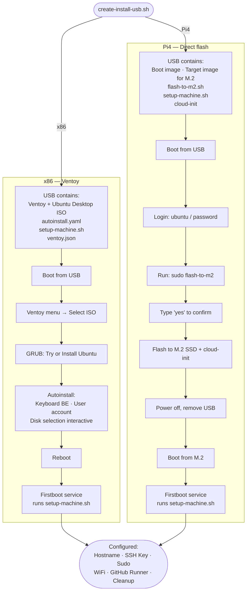
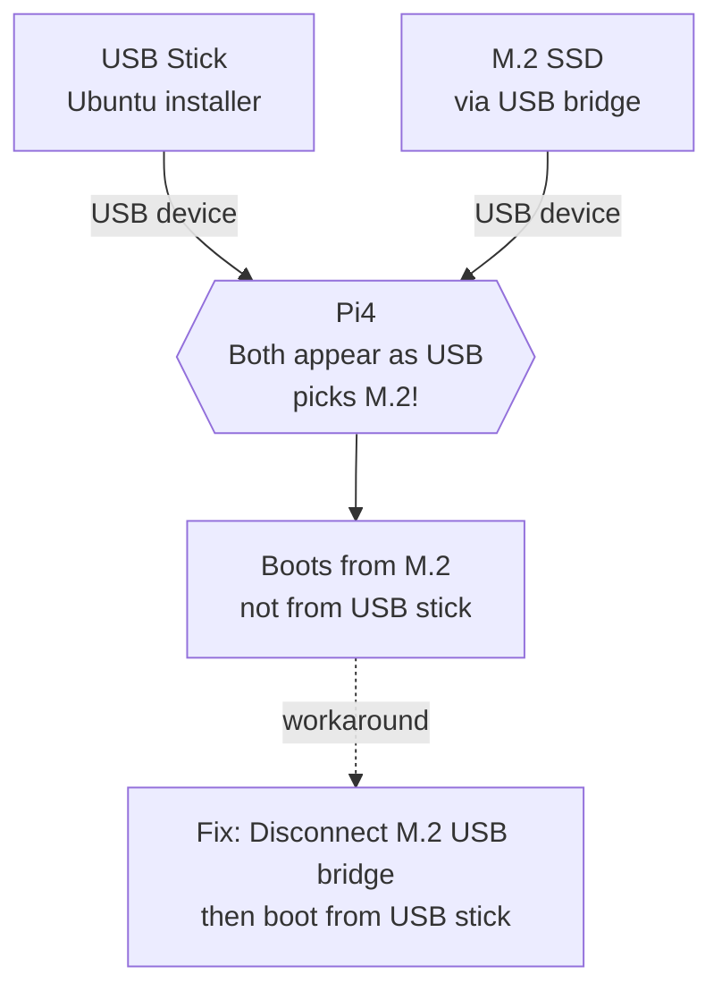

# Ubuntu Install USB Creator

Single script to create bootable USB for automated Ubuntu installation on x86 and Raspberry Pi 4.

## Quick Start

```bash
# Create a new install USB (full flash)
sudo ./create-install-usb.sh

# Update hostname/labels on an existing USB (no re-flash)
sudo ./create-install-usb.sh --update
```

## Installation Flow



## When is Network Required?

| Phase | Network needed? | Why |
|-------|-----------------|-----|
| USB Creation (this machine) | Yes | Download ISO, Ventoy |
| Boot & Install (target) | Recommended * | x86 installer may need network |
| Firstboot script (target) | **YES — ethernet required** | GitHub CLI + Runner download (~220 MB) |
| After firstboot | Optional | WiFi configured by script |

\* x86 autoinstall may fail without network. Pi4 works offline.

> **CRITICAL:** Plug in ethernet **before** starting install to avoid errors during firstboot.

## x86 vs Raspberry Pi 4

| Aspect | x86 (Intel/AMD) | Raspberry Pi 4 |
|--------|-----------------|----------------|
| Boot method | Ventoy multiboot USB | Direct image flash |
| Target disk | Any (interactive selection) | M.2 SSD in Argon One case |
| Install process | Automated via autoinstall | Two-stage: USB boot + flash |
| Image type | Desktop ISO | Preinstalled server/desktop |
| Architecture | amd64 | arm64 |
| Runner arch | x64 | arm64 |
| WiFi config | Yes (in setup-machine.sh) | Yes (in setup-machine.sh) |
| Partitioning | EFI + 80GB root + backup | 80GB root + backup (auto) |

## Automatic Partitioning

For disks > 100GB, the flash script automatically creates:

| Partition | Size | Mount | Purpose |
|-----------|------|-------|---------|
| sda1 | 512MB | /boot/firmware | Boot (FAT32) |
| sda2 | 80GB | / | Root filesystem (ext4) |
| sda3 | Rest | /mnt/backup | Backups (ext4, label: backup) |

The backup partition is automatically added to `/etc/fstab` and mounted at `/mnt/backup` on first boot.

## What Gets Configured

The `setup-machine.sh` script (runs on first boot) configures:

1. **Hostname** - as specified during USB creation
2. **SSH Key** - added to authorized_keys
3. **Sudo** - passwordless for the user
4. **SSH Server** - enabled and started
5. **WiFi** - connects via NetworkManager (if configured)
6. **GitHub Runner** - self-hosted runner registered to repo
7. **Cleanup** - sensitive files removed, script self-destructs

## Sensitive Data

The USB contains credentials (password hash, SSH key, GitHub PAT, WiFi password).

After successful installation:
- Firstboot script attempts cleanup but may fail (Ventoy partition not mountable)
- **Manually delete** from USB after confirming successful install:
  ```bash
  rm /media/*/Ventoy/SETUP/autoinstall.yaml
  rm /media/*/Ventoy/SETUP/user-data
  rm /media/*/Ventoy/SETUP/setup-machine.sh
  ```
- Or keep USB secured for future reinstalls

## Update Mode (`--update`)

When you already have a working USB and only want to change the **hostname** or **runner labels** (e.g. to reuse the same USB for a different machine), use update mode instead of re-flashing.

```bash
sudo ./create-install-usb.sh --update
```

**What it does:**
1. Detects the USB type automatically (x86 Ventoy or Pi4)
2. Reads the current hostname from the embedded setup script
3. Asks for a new hostname and optional runner role label
4. Updates the relevant files in-place (no re-flash, no ISO download)
5. Unmounts safely

**Files updated:**

| USB type | Files |
|----------|-------|
| x86      | `SETUP/setup-machine.sh`, `SETUP/autoinstall.yaml`, `SETUP/user-data` |
| Pi4      | `opt/pi4-flash/setup-machine.sh` |

**When to use:**

| Scenario | Command |
|----------|---------|
| Reuse USB for different machine (new hostname) | `--update` |
| Add role label (homeassistant / pihole) | `--update` |
| Different OS version, architecture, or user | Full `create` run |

**Example: prepare USB for PiHole machine**
```bash
sudo ./create-install-usb.sh --update
# Select USB device
# New hostname: pihole-pi4
# Role label:   pihole
```

## Troubleshooting

### "No USB devices found"
- Check USB is connected
- Script uses `lsblk TRAN` column to detect USB transport

### Installation fails with network error
- Ethernet must be connected for firstboot script
- WiFi is configured BY the script, not before it

### Firstboot script not running
- Check: `systemctl status firstboot-setup.service`
- Logs: `journalctl -u firstboot-setup.service`

### GitHub Runner not registering
- Verify PAT has correct permissions: `repo`, `workflow`, `admin:org`
- Check network connectivity

### Pi4: Boots from M.2 instead of USB

The Pi4 sees both the M.2 SSD (via USB bridge in Argon One case) and the USB stick as USB devices.
It cannot distinguish boot priority between them.



**Solution:**
1. **To boot from USB stick**: Disconnect the USB bridge cable inside the Argon One case (the small cable connecting M.2 to Pi4's USB)
2. **After flashing**: Reconnect the USB bridge cable before rebooting to boot from M.2

### Pi4: Undervoltage detected
If you see "Under-voltage detected" warnings:
- Use official Raspberry Pi power supply (5.1V 3A)
- Check USB-C cable quality - some cables have high resistance
- Avoid USB hubs or extension cables for power

## Files Created on USB (x86/Ventoy)

```
/media/*/Ventoy/
├── ubuntu-XX.XX-desktop-amd64.iso    # Ubuntu Desktop ISO
├── SETUP/
│   ├── autoinstall.yaml              # Autoinstall config (embedded script)
│   ├── user-data                     # Copy of autoinstall.yaml
│   ├── meta-data                     # Cloud-init metadata
│   ├── setup-machine.sh              # Post-install script (backup copy)
│   └── README.txt                    # Quick reference
└── ventoy/
    ├── ventoy.json                   # Ventoy autoinstall config
    └── ventoy_grub.cfg               # Adds autoinstall kernel param
```

## Files Created on USB (Pi4)

```
/opt/pi4-flash/                       # On bootable Ubuntu Server image
├── flash-to-m2.sh                    # Main flash script
├── setup-machine.sh                  # Post-install config (with WiFi!)
├── firstboot-setup.service           # Systemd service for auto-run
├── run-setup-in-terminal.sh          # Terminal launcher (desktop only)
├── ubuntu-XX.XX-preinstalled-*.img.xz # Target image for M.2
└── README.txt                        # Quick reference
```

## TODO's
- [ ] Add advice for scenarios where 2 runners can be triggered

### Completed (01/03)
- [x] Mermaid diagrams added (Installation Flow, Pi4 Boot Priority)

### Completed (28/02)
- [x] `--update` mode added: update hostname/labels on existing USB without re-flash

### Completed (16/02)
- [x] USB bridge boot order documented (troubleshooting section)
- [x] Network requirement documented (ethernet before firstboot)
- [x] Sensitive files cleanup verified on Pi4
- [x] Cloudflared connectivity verified
- [x] Solar plugin historical data migrated from SD card to M.2
- [x] Automatic partitioning added to flash-to-m2.sh (80GB root + backup)
- [x] Backup partition auto-mounted at /mnt/backup via fstab
