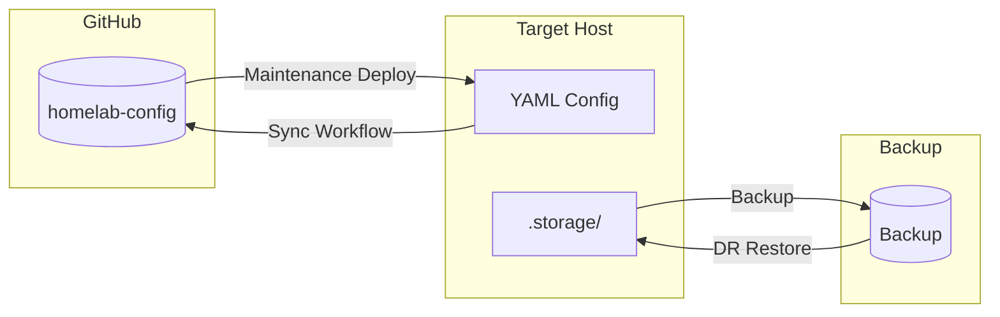
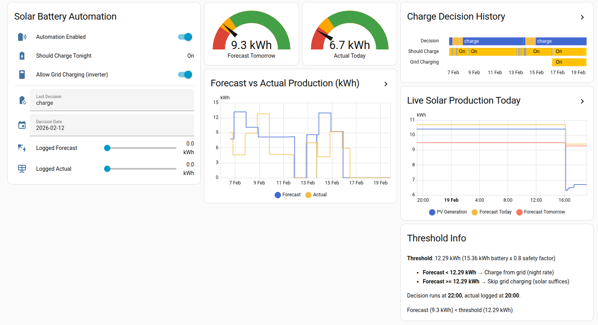

# Home Assistant Role

Deploys Home Assistant Container with supporting services via Docker Compose.

## Overview

This role deploys a complete Home Assistant stack including:

- **Home Assistant Core** - Smart home automation platform
- **Cloudflared** - Secure tunnel for external access (optional)
- **Code Server** - VS Code in browser for config editing (optional)
- **ESPHome** - ESP device management (optional)
- **SSH Terminal** - Remote shell access (optional)
- **Samba** - Network file sharing (optional)

## Requirements

- Ubuntu 22.04+ target host
- Docker & Docker Compose (installed by role if missing)
- GitHub PAT for repository access
- Cloudflare tunnel token (if `enable_cloudflared: true`)

## Deployment Modes

| Mode | Use Case | Behavior |
|------|----------|----------|
| **Maintenance** (default) | Config updates | Syncs YAML from Git, preserves `.storage/` (runtime state) |
| **Disaster Recovery** | Fresh install / restore | Full cleanup, restores `.storage/` from backup |

```bash
# Maintenance mode (default)
ansible-playbook site.yml -i inventories/ha_target_local.ini -l ha_target

# Disaster recovery mode
ansible-playbook site.yml -i inventories/ha_target_local.ini -l ha_target -e maintenance_mode=false
```

## Role Variables

### Required (via environment or extra-vars)

| Variable | Description |
|----------|-------------|
| `GITHUB_USERNAME` | GitHub username for repo access |
| `GITHUB_PAT` | GitHub Personal Access Token |
| `CF_TUNNEL_TOKEN` | Cloudflare tunnel token (when cloudflared enabled) |
| `HA_BACKUP_ENCRYPT_KEY` | Encryption key for backup restore |
| `HA_USER_USERNAME` | Bootstrap user (fresh install only) |
| `HA_USER_PASSWORD` | Bootstrap password (fresh install only) |

### Configurable (in `group_vars/all.yml`)

| Variable | Default | Description |
|----------|---------|-------------|
| `ha_version` | `stable` | HA version tag |
| `ha_host_port` | `8123` | Host port for HA web UI |
| `enable_cloudflared` | `true` | Enable Cloudflare tunnel |
| `enable_code_server` | `true` | Enable VS Code server |
| `enable_esphome` | `true` | Enable ESPHome |
| `enable_ssh_terminal` | `true` | Enable SSH access |
| `enable_samba` | `true` | Enable Samba shares |

## Directory Structure

```
Target host:
~/homelab/target/
├── ha-stack-ansible/           # Docker Compose project
│   ├── docker-compose.yml
│   ├── .ha_version.lock        # Pinned HA version
│   └── data/                   # Service data (code-server, esphome, ssh)
└── homeassistant-ansible/
    └── config/                 # HA configuration
        ├── configuration.yaml
        ├── automations.yaml
        ├── .storage/           # Runtime state (protected)
        └── ...
```

## Config Sync Flow



| Content | Git | Backup |
|---------|-----|--------|
| YAML files (configuration.yaml, automations.yaml, etc.) | Bidirectional sync | Included |
| `.storage/` (runtime state, UI config) | Excluded | Protected |

---

## Dashboard Reference

### Solar Dashboard



The Solar dashboard monitors the automated battery charging system.

#### Solar Battery Automation (left panel)

| Element | Description |
|---------|-------------|
| **Automation Enabled** | Master switch for the night-charge automation |
| **Should Charge Tonight** | Calculated binary sensor: `forecast < 12.29 kWh` |
| **Allow Grid Charging** | Actual inverter switch (controlled by automation) |
| **Last Decision** | What the automation decided: `charge` or `skip` |
| **Decision For Date** | The date this charging decision applies to (tomorrow) |
| **Logged Forecast** | Forecast at decision time (for validation) |
| **Logged Actual** | Actual production logged next day |

#### Gauges (top center)

| Gauge | Description |
|-------|-------------|
| **Forecast Tomorrow** | Predicted solar production (kWh) from Forecast.Solar |
| **Actual Today** | Real production so far today from inverter |

**Color coding:**
- Green (>= 12.29 kWh): Sufficient sun, no grid charging needed
- Yellow (8-12.29 kWh): Borderline
- Red (< 8 kWh): Low sun, grid charging recommended

#### Forecast vs Actual (center)

14-day history comparing:
- Blue: Forecasted production
- Yellow: Actual production

Helps validate forecast accuracy over time.

#### Charge Decision History (top right)

14-day overview showing:
- Decision: `charge` (yellow) or `skip`
- Should Charge: Binary sensor state
- Grid Charging: Actual inverter switch state

#### Live Solar Production (right)

24-hour view with:
- PV Generation: Real-time production curve
- Forecast Today: Predicted (horizontal line)
- Forecast Tomorrow: Next day prediction

#### Threshold Info (bottom right)

Explains the decision logic:
- **Threshold**: 12.29 kWh = 15.36 kWh battery × 0.8 safety factor
- **Forecast < threshold** → Charge from grid (night rate)
- **Forecast >= threshold** → Skip charging (solar suffices)

---

## Documentation

| Document | Description |
|----------|-------------|
| [Solar Battery Automation](docs/SOLAR_BATTERY_AUTOMATION.md) | Complete technical documentation: algorithm, backtest results, troubleshooting |

---

## Usage Examples

### Fresh deployment (new host)

```bash
# Set required environment variables
export GITHUB_USERNAME="your-username"
export GITHUB_PAT="ghp_..."
export CF_TUNNEL_TOKEN="..."
export HA_BACKUP_ENCRYPT_KEY="..."
export HA_USER_USERNAME="admin"
export HA_USER_PASSWORD="..."

# Run disaster recovery mode
ansible-playbook site.yml \
  -i inventories/ha_target_remote.ini \
  -l ha_target \
  -e maintenance_mode=false
```

### Config update (existing host)

```bash
# Maintenance mode (default) - preserves runtime state
ansible-playbook site.yml \
  -i inventories/ha_target_local.ini \
  -l ha_target
```

### Emergency version override

```bash
ansible-playbook site.yml \
  -i inventories/ha_target_local.ini \
  -l ha_target \
  -e ha_version_override=2025.1.0
```

---

## Container Access

| Service | URL | Port |
|---------|-----|------|
| Home Assistant | `http://<target-ip>:8123` | 8123 |
| Code Server | `http://<target-ip>:8443` | 8443 |
| ESPHome | `http://<target-ip>:6052` | 6052 |
| SSH | `ssh -p 2222 <target-ip>` | 2222 |

> Replace `<target-ip>` with your host's IP address (e.g., from `ansible_host` in your inventory).
