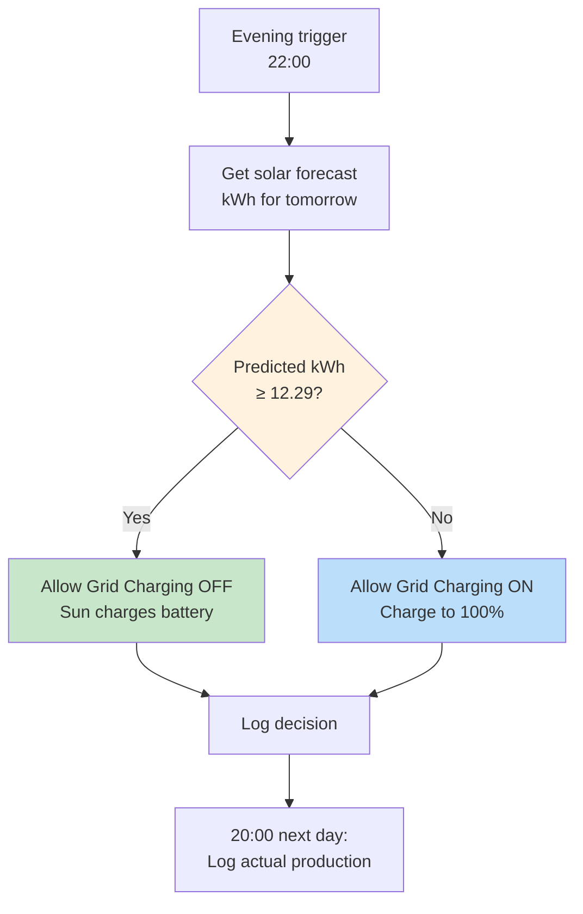
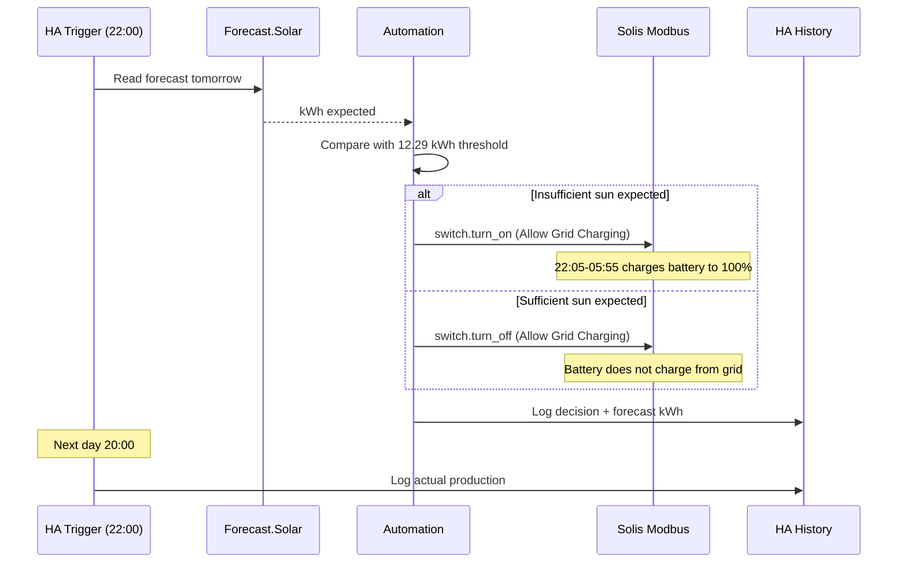

# Solar Battery Automation

Automatic decision whether to charge the home battery overnight to 100% based on predicted solar energy production (kWh) for the next day.

## Goal

Automatically configure the Solis inverter to charge the battery to 100% overnight (from the grid, at night rate) when expected solar production the next day is insufficient to fill the battery during daytime.



---

## Current Status: LIVE

The automation has been running in production since 2026-02-03.

**Operating mode:** Binary decision via `switch.allow_grid_to_charge_the_battery`
- **Insufficient sun expected** (forecast < 12.29 kWh) → Allow Grid Charging **ON** → battery charges to 100% via TOU slot (22:05-05:55)
- **Sufficient sun expected** (forecast >= 12.29 kWh) → Allow Grid Charging **OFF** → battery does not charge from grid, sun does the work

**Evolution path:**
1. ~~Phase 1: Observe-only~~ (skipped)
2. **Phase 2: Binary control (CURRENT)** — Allow Grid Charging on/off
3. Phase 3: Gradual SoC cutoff adjustment (once forecast accuracy is proven)

---

## Key Decisions

### Why kWh forecast, not cloud cover?

Cloud cover percentage is **not suitable** as a decision metric:

| Problem | Explanation |
|---------|-------------|
| **Cloud type ignored** | Thin cirrus clouds let 60-80% of light through, thick rain clouds only 10-20% |
| **Timing ignored** | Cloud cover in the morning vs afternoon has different impact |
| **Diffuse light** | Even cloudy days produce significant energy (observation: cloudy day with full production) |

**Solar forecast services** (Forecast.Solar, Solcast) directly provide a **kWh prediction** that accounts for:
- Cloud type and thickness (via satellite data)
- Your specific panel configuration
- Historical accuracy for your region

### Why a binary decision (on/off)?

A **gradual** charging algorithm ("charge to 47%") seems smarter but is false precision:

```
Forecast uncertainty:     ±15%
Consumption uncertainty:  ±20% (variable daily usage)
─────────────────────────────────
Combined error:           ±35% or more
```

**Binary is more robust** because costs are asymmetric:
- **Unnecessary charging**: Costs night rate (cheap) → acceptable
- **Not charging when needed**: Costs day rate (expensive) → avoid

Therefore: **when in doubt → charge to 100%**

### Why Allow Grid Charging, not SoC cutoff?

The Solis inverter offers two ways to control night charging:

| Method | Entity | How it works |
|--------|--------|--------------|
| **Allow Grid Charging** (chosen) | `switch.allow_grid_to_charge_the_battery` | On/off switch. TOU slot and SoC cutoff (100%) remain unchanged. |
| SoC cutoff adjustment | `number.solis_s5_eh1p_grid_time_of_use_charge_cut_off_soc_slot_1` | Change SoC% (100% = charge, 10% = don't charge). |

**Allow Grid Charging was chosen** for phase 2 because:
- It's a simple on/off toggle — no risk of incorrect SoC values
- The TOU configuration (times, currents, SoC 100%) remains untouched
- It maps exactly to the "Allow Grid Charging" setting in the Solis Cloud UI

**SoC cutoff** is considered for phase 3 (gradual charging to X%).

### Why not via Solis Cloud Control API?

The `solis_cloud_control` custom component (`select.rc_force_charge_discharge`) is **not usable**:
- No API key available
- No permission from installer for API calls
- RC Force Charge has a 5-minute timeout (unsuitable for overnight charging)

All control is done via **`solis_modbus`** (local Modbus TCP connection).

---

## Success Criteria

| Criterion | Target | Measurement |
|-----------|--------|-------------|
| **Correct decisions** | >= 95% | (correct decisions / total decisions) x 100 |
| **False negatives** | Minimize | Days without night charging where battery ran empty |
| **False positives** | Acceptable | Days with night charging where sun was sufficient (costs some, but no problem) |

### Definition of "correct decision"

A decision is **correct** if:
- **No charge decided** AND battery reached >=80% SoC during the day from sun, OR
- **Charge decided** AND battery would NOT have reached >=80% SoC without night charging

---

## Backtest Results

### Dataset

- **Period:** September 2025 - January 2026 (116 days with complete data)
- **Source:** Home Assistant production database + Open-Meteo historical weather data
- **Analysis location:** `analysis/solar/`

### Results with perfect forecast

| Metric | Value |
|--------|-------|
| **Accuracy** | 94.8% |
| **False negatives** | 1 day (not charged when needed) |
| **False positives** | 5 days (charged when not needed) |

**Conclusion:** Just under the 95% target, but false negatives (the expensive error) are very low.

### Simulation with forecast errors (Monte Carlo)

To test the impact of forecast uncertainty, 100 simulations were run per error scenario:

| Scenario | Accuracy | Range | False neg | False pos |
|----------|----------|-------|-----------|-----------|
| Perfect (0% error) | 94.8% | 95-95% | 1.0 | 5.0 |
| ±5% random | 94.7% | 94-95% | 1.0 | 5.2 |
| ±10% random | 94.2% | 92-96% | 1.1 | 5.5 |
| **±15% random** | **94.2%** | 92-96% | **1.2** | **5.5** |
| ±20% random | 94.3% | 92-97% | 1.2 | 5.5 |
| ±25% random | 93.8% | 91-97% | 1.5 | 5.7 |
| ±15% + 10% optimistic bias | 94.4% | 91-97% | 2.5 | 4.0 |
| ±15% + 10% pessimistic bias | 93.5% | 91-95% | 0.5 | 7.0 |

### Key Findings

1. **Robust against forecast errors:** Even with ±15% random error (typical Forecast.Solar margin) accuracy remains ~94%

2. **False negatives stay low:** The safety mechanism (factor 0.8) keeps false negatives (empty battery due to not charging) rare (1-2 days out of 116)

3. **Asymmetric costs work:** The algorithm is intentionally conservative. The 5-6 false positives (unnecessary charging) cost little, while the rare false negatives are the expensive error

4. **Pessimistic bias helps:** A forecast that's slightly too pessimistic (10% below actual) reduces false negatives to 0.5 days on average

### Forecast.Solar Validation

**Limitation:** Historical Forecast.Solar predictions cannot be retrieved - the API only provides forecasts for today and future days. Direct comparison with their stated ±15% margin is therefore not possible.

**Alternative:** Real-time validation via the automation itself: each evening the forecast is logged (`input_number.solar_forecast_kwh`) and the next day the actual production (`input_number.solar_actual_kwh`). This data builds up history in HA and can be compared in a dashboard graph.

### Data Locations

```
analysis/solar/
├── data/ha_database/
│   ├── daily_pv_production.csv      # Daily PV production
│   ├── daily_solar_data.csv         # Incl. battery and grid data
│   ├── backtest_results.csv         # Backtest output per day
│   └── backtest_with_errors.txt     # Monte Carlo results
├── data/weather/
│   └── weather_2025-07-01_2026-02-01.json
└── scripts/
    ├── backtest.py                  # Backtest script
    └── fetch_weather.py             # Fetch weather data
```

---

## Technical Architecture

### Components

```
Forecast data:
  forecast_solar/              # Native HA integration (free, no registration)
    → sensor.energy_production_tomorrow    (kWh prediction)

Decision logic:
  configuration.yaml
    → binary_sensor.solar_should_charge_tonight  (forecast < 12.29 kWh?)

Inverter control:
  custom_components/solis_modbus/    # Local Modbus TCP connection
    → switch.allow_grid_to_charge_the_battery    (on/off grid charging)

Existing TOU configuration (untouched):
    → time.solis_s5_eh1p_grid_time_of_use_charge_start_slot_1  (22:05)
    → time.solis_s5_eh1p_grid_time_of_use_charge_end_slot_1    (05:55)
    → number.solis_s5_eh1p_grid_time_of_use_charge_cut_off_soc_slot_1  (100%)

Logging:
    → input_number.solar_forecast_kwh    (forecast stored)
    → input_number.solar_actual_kwh      (actual production stored)
    → input_text.solar_charge_decision   (charge / no_charge)
    → input_text.solar_decision_date     (decision date)

Master toggle:
    → input_boolean.solar_night_charge_enabled   (enable/disable automation)
```

### Data Flow



### Automations Overview

| Automation | Trigger | Action |
|------------|---------|--------|
| `solar_night_charge_decision` | 22:00 | Check forecast, toggle Allow Grid Charging, log decision |
| `solar_evening_log_actual` | 20:00 | Log actual production for validation |

### Solis Inverter Settings

**Work Mode:** Self-Use (unchanged)

**TOU Charge Slot 1** (unchanged, always configured):

| Parameter | Entity | Value |
|-----------|--------|-------|
| Start time | `time...charge_start_slot_1` | 22:05 |
| End time | `time...charge_end_slot_1` | 05:55 |
| SoC cutoff | `number...charge_cut_off_soc_slot_1` | 100% |
| Current | `number...charge_battery_current_slot_1` | 50A |
| Slot enabled | `switch.grid_time_of_use_charging_period_1` | on |

**Allow Grid Charging** (controlled by automation):

| Parameter | Entity | Value |
|-----------|--------|-------|
| Grid charging allowed | `switch.allow_grid_to_charge_the_battery` | on/off (dynamic) |

---

## Testing

### Manual testing of the automation

**Prerequisites:**
- `input_boolean.solar_night_charge_enabled` must be **on**
- Forecast.Solar integration must be delivering data (`sensor.energy_production_tomorrow`)

**Test 1: "charge" path (insufficient sun)**

Tests whether the automation correctly enables grid charging.

1. Manually set `switch.allow_grid_to_charge_the_battery` to **OFF**:
   - Developer Tools > Actions > `switch.turn_off`
   - Target: `switch.allow_grid_to_charge_the_battery`
   - Perform action
2. Verify in Solis Cloud that "Allow Grid Charging" shows **Disable**
3. Trigger the automation:
   - Developer Tools > Actions > `automation.trigger`
   - Target: `Solar - Night Charge Decision`
   - Perform action
4. **Expected result** (when forecast < 12.29 kWh):
   - `input_text.solar_charge_decision` = "charge"
   - `switch.allow_grid_to_charge_the_battery` = **on**
   - Solis Cloud shows "Allow Grid Charging" = **Enable**
   - Logbook entry: "Night charge ENABLED"

**Test 2: "no_charge" path (sufficient sun)**

Tests whether the automation correctly disables grid charging. Requires the forecast
to be above the threshold. In winter this is rare; to test anyway:

1. Temporarily adjust the threshold in `configuration.yaml`:
   ```yaml
      # temporarily lowered from 12.29
   ```
2. Reload HA configuration
3. Manually set `switch.allow_grid_to_charge_the_battery` to **ON**
4. Trigger the automation
5. **Expected result**:
   - `input_text.solar_charge_decision` = "no_charge"
   - `switch.allow_grid_to_charge_the_battery` = **off**
   - Solis Cloud shows "Allow Grid Charging" = **Disable**
6. **Don't forget:** Reset threshold to 12.29 and redeploy!

**Test 3: Overnight run (live)**

Let the automation run at 22:00 and check the next morning:

1. Check `input_text.solar_charge_decision` for the decision
2. Check `input_number.solar_forecast_kwh` for the forecast used
3. Check `input_text.solar_decision_date` for the date
4. Check Solis Cloud for the status of "Allow Grid Charging"
5. Check after 20:00 `input_number.solar_actual_kwh` for actual production

### Monitoring checklist (daily/weekly)

- [ ] Compare forecast vs actual production (automatically logged)
- [ ] Review decisions in HA Logbook (search for "Solar Battery")
- [ ] Verify in Solis Cloud that Allow Grid Charging matches the decision

---

## Decision Algorithm

```python
# Binary algorithm with safety margin
BATTERY_CAPACITY_KWH = 15.36
SAFETY_FACTOR = 0.8
THRESHOLD_KWH = BATTERY_CAPACITY_KWH * SAFETY_FACTOR  # 12.29 kWh

if forecast_tomorrow_kwh < THRESHOLD_KWH:
    # Insufficient sun expected → grid charging ON
    switch.allow_grid_to_charge_the_battery = ON
else:
    # Sufficient sun expected → grid charging OFF
    switch.allow_grid_to_charge_the_battery = OFF
```

### Why factor 0.8?

- **Safety margin** against forecast errors
- **Conservative**: better to charge unnecessarily (cheap) than run short (expensive)
- **Tunable**: can be adjusted later based on validation data

---

## System Parameters

| Parameter | Value | Source |
|-----------|-------|--------|
| **Battery capacity** | 15.36 kWh | Solis S5-EH1P |
| **PV capacity** | 7.04 kWp | Installation |
| **Inverter capacity** | 6.0 kW | Solis S5-EH1P |
| **Threshold** | 12.29 kWh | 15.36 x 0.8 (safety factor) |
| **Panel tilt** | 30° | Solis Cloud |
| **Panel orientation** | South (180°) | Based on peak hours analysis |
| **Location** | 50.78516, 3.91139 | |
| **Safety factor** | 0.8 | Validated via backtest |
| **Trigger time** | 22:00 | 5 min before TOU charge window |
| **Charge window** | 22:05 - 05:55 | Night rate hours |

---

## Forecast Service

| Property | Value |
|----------|-------|
| **Service** | Forecast.Solar |
| **Price** | Free (basic tier) |
| **HA Integration** | Native (`forecast_solar`) |
| **Registration** | Not required |
| **Update interval** | Once per hour |
| **Config entry version** | 2 (manually patched, see troubleshooting) |

### Forecast.Solar Configuration

| Parameter | Value |
|-----------|-------|
| Latitude | 50.78516 |
| Longitude | 3.91139 |
| Declination (tilt) | 30° |
| Azimuth | 180° (south) |
| Modules power | 7040 W |
| Inverter size | 6000 W |
| Damping morning | 0.0 |
| Damping evening | 0.0 |

---

## Troubleshooting

### Forecast.Solar "Error migrating entry" (KeyError: 'modules power')

**Problem:** HA 2026.1.x expects config entry version 2, but the entry is created as version 1. The migration code looks for keys with spaces in `options`, but the data is in `data` with underscores.

**Solution:**
1. Stop HA
2. Edit `/config/.storage/core.config_entries`
3. Find the `forecast_solar` entry
4. Move `declination`, `azimuth`, `modules_power`, `damping_morning`, `damping_evening`, `inverter_power` (as `inverter_size`) from `data` to `options`
5. Keep only `latitude` and `longitude` in `data`
6. Set `version` to `2`
7. Start HA

**Correct structure:**
```json
{
  "version": 2,
  "data": {
    "latitude": 50.78516,
    "longitude": 3.91139
  },
  "options": {
    "declination": 30,
    "azimuth": 180,
    "modules_power": 7040,
    "damping_morning": 0.0,
    "damping_evening": 0.0,
    "inverter_size": 6000
  }
}
```

### Modbus write actions not working

**Check:**
1. Is `switch.solis_modbus_enabled` set to **on**?
2. Are Modbus sensors available (not "unavailable")?
3. Test via Developer Tools > Actions > `switch.turn_off` on `switch.allow_grid_to_charge_the_battery` and verify in Solis Cloud

### Automation not triggering at 22:00

**Check:**
1. Is `input_boolean.solar_night_charge_enabled` set to **on**?
2. Does `sensor.energy_production_tomorrow` exist? (Developer Tools > States)
3. Check `automation.solar_night_charge_decision` — is `last_triggered` populated?

---

## Decision Log

| Date | Decision | Rationale |
|------|----------|-----------|
| 2026-01-31 | Start with Forecast.Solar | Free, native HA integration, no registration. If accuracy insufficient, switch to Solcast. |
| 2026-01-31 | 95% as success criterion | High standard but achievable. 5% error margin acceptable given low cost of false positives. |
| 2026-01-31 | Iterative approach | Start simple with external service, validate with own data, refine if needed. |
| 2026-02-01 | kWh forecast instead of cloud cover | Cloud cover says nothing about cloud type/thickness. Cloudy days can still have good production. kWh forecast is the right metric. |
| 2026-02-01 | Binary decision (100% or nothing) | Daily consumption is too unpredictable for gradual approach. Combined errors (±35%) make "charge to X%" false precision. Costs are asymmetric: unnecessary charging is cheap, shortage is expensive. |
| 2026-02-01 | Safety factor 0.8 | Conservative margin. When in doubt, charging is the safe choice. Factor can be tuned later based on validation data. |
| 2026-02-02 | Backtest validates approach | 116 days historical data gives 94.8% accuracy. Slightly under 95% target, but false negatives (1 day) are very low. Monte Carlo with ±15% forecast error still gives ~94% accuracy. |
| 2026-02-02 | Forecast.Solar comparison not possible | API doesn't provide historical predictions. Set up real-time validation as alternative. |
| 2026-02-03 | Allow Grid Charging instead of RC Force Charge | Solis Cloud Control API not available (no key/permission). RC Force Charge has 5 min timeout. Allow Grid Charging via Modbus is reliable and simple. |
| 2026-02-03 | Allow Grid Charging instead of SoC cutoff | Phase 2 starts conservatively with on/off toggle. SoC cutoff manipulation reserved for phase 3 (gradual charging). TOU configuration (times, SoC 100%) remains untouched. |
| 2026-02-03 | Forecast.Solar config entry fix | Version 1 → 2 manually patched + data/options restructuring. See troubleshooting section. |

---

## Changelog

| Date | Change |
|------|--------|
| 2026-01-31 | Initial document created |
| 2026-02-01 | Cloud cover replaced by kWh-based forecast as decision metric |
| 2026-02-01 | Binary algorithm added (charge to 100% or not) with rationale |
| 2026-02-01 | Safety factor 0.8 introduced |
| 2026-02-02 | Backtest results added (116 days, 94.8% accuracy) |
| 2026-02-02 | Monte Carlo simulation with forecast errors (±15%: 94.2% accuracy) |
| 2026-02-02 | System parameters filled in (15.36 kWh battery, 7.04 kWp PV, threshold 12.29 kWh) |
| 2026-02-03 | Forecast.Solar integration working (config entry version fix) |
| 2026-02-03 | Automation live: `switch.allow_grid_to_charge_the_battery` via Modbus |
| 2026-02-03 | Morning reset automation removed (not needed with TOU window) |
| 2026-02-03 | Test scenarios added |
| 2026-02-03 | Troubleshooting section added |
| 2026-02-03 | Architecture updated with definitive entities and data flow |
